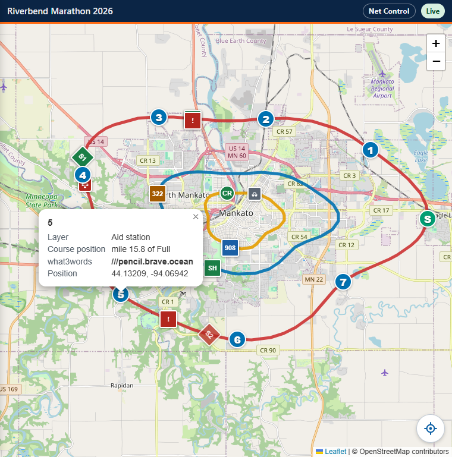
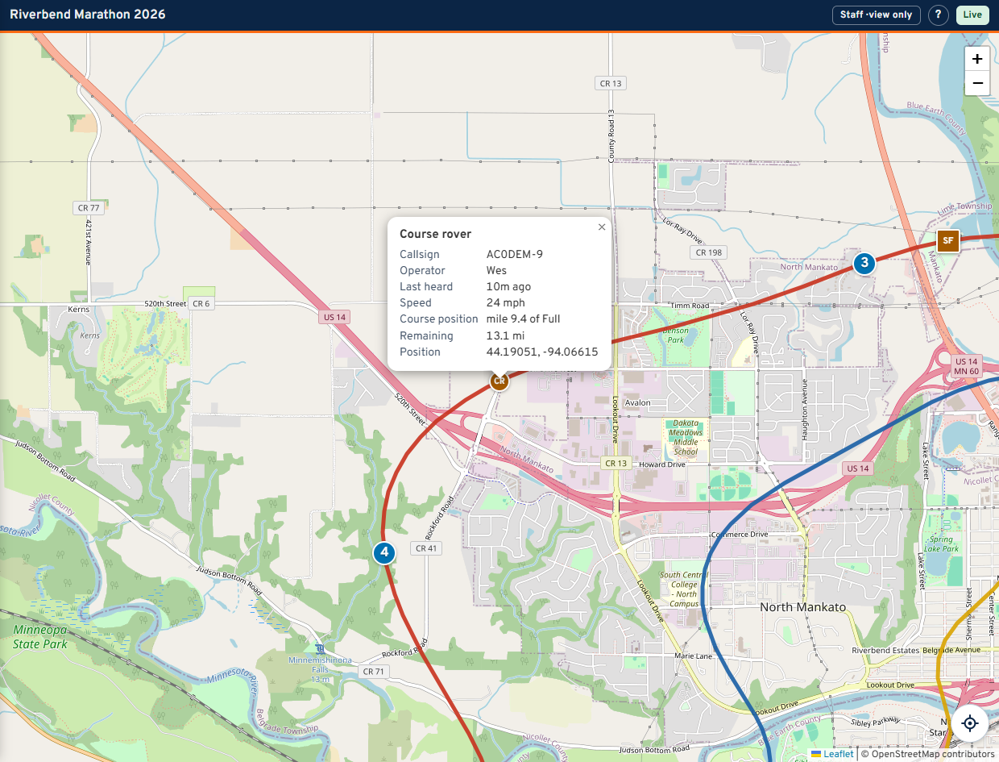
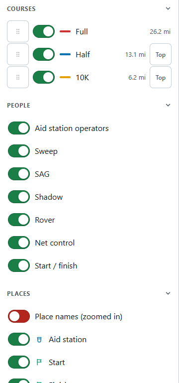
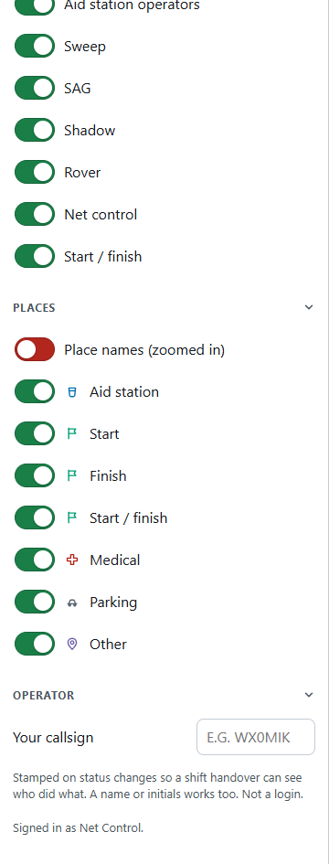
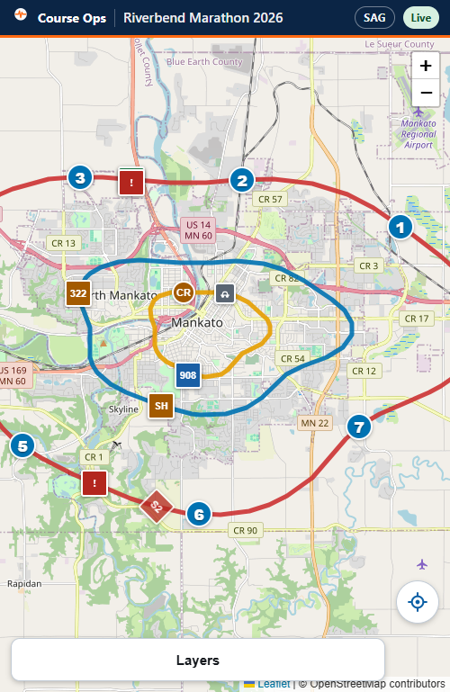
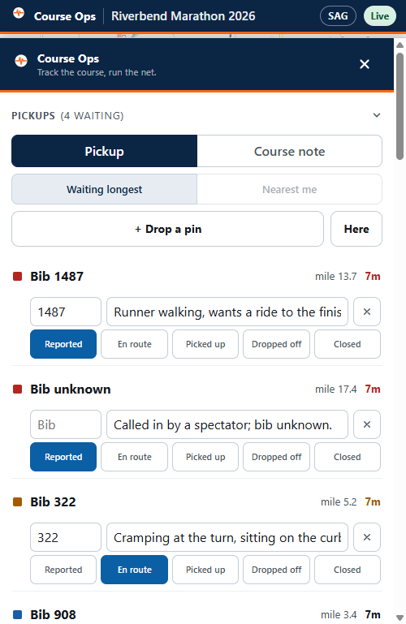

# The basics, whichever link you hold

Everything on this page works the same for every role. Your own page says what
you may change: [Net Control](net-control.md), [SAG](sag.md),
[Liaison](liaison.md), [Logistics](logistics.md), [Staff](staff.md).

> ## The radio comes first
>
> **Course Ops is supplemental. It does not replace the net.**
>
> Everything still goes over the air to Net Control - **including anything you
> enter here yourself.** Drop the pin *and* call it in. A pin is a note on a
> map; the net is where it becomes a decision somebody is accountable for.
>
> Phones lose signal in the low spots, batteries die, and a screen can be
> minutes behind without saying so. If it was not on the air, treat it as
> though nobody knows.

## Open the link and leave it open

Tap the link you were sent. There is nothing to install, no password, and no
account. The page updates itself as reports come in - do not refresh it to see
whether something changed.

**Add it to your home screen** so it opens full screen and you are not hunting
through a text message at 07:00 on race morning.

- iPhone / iPad: Share, then *Add to Home Screen*.
- Android: the browser menu, then *Install app* or *Add to Home screen*.

## The top bar

The badge on the far right is the one to keep half an eye on. It is the only
thing that tells you whether what you are looking at is current.

| Badge | Meaning |
|---|---|
| **Live** | Connected. Positions and reports arrive as they happen |
| **Connecting...** | Trying |
| **Reconnecting...** | The connection dropped. What is on screen may be minutes old |
| **Access denied** | The link has been revoked, or it is for a different event. Ask for a new one |

The badge beside it is your role. It never changes colour, and it is never an
alarm - it is there so you can tell at a glance which link you are holding.

**The `?` between them opens your guide** - this page's role-specific companion,
in a new tab, so you never lose the map to read it. Whichever link you are
holding, the `?` goes to the page written for it.

## The map

- **Coloured lines** are the races. Each race has its own colour, and the same
  colour is usually the bib colour for that race.
- **Pins** are places from the organizer's course file: aid stations, start and
  finish, medical, parking. A pin carries one or two characters - the aid
  station's number or letter - so you can name it without opening it.
- **Round, square and diamond markers** are people with radios. Round is a
  general station, **square is a sweep**, **diamond is SAG**. The two or three
  characters on the marker come from the station's name.
- **A red square with a bib number** is a pickup - somebody waiting for a ride.
  It changes colour as it is dispatched and delivered.
- **A round purple pin** is a course note: a cone in the road, a turn nobody is
  marshalling. Nobody is waiting at one. It is a different shape as well as a
  different colour, so the two never have to be told apart by colour alone.

Tap anything to open it.

A station popup gives the callsign, the operator, how long since it was last
heard, and **where it is on the course** - "mile 11.6 of Full". That mile figure
is what gets said on the air.

A place popup gives its layer, its position on the course and its What3Words
address if the club entered one.

### Positions jump, and that is correct

An APRS position arrives every one to five minutes, sometimes less often in the
hills. Markers move in steps. **Nothing is smoothed or animated**, because a
marker gliding along a road it was never reported on is a position somebody
would act on.

### Marker colours: how long since we heard them

| Colour | Meaning |
|---|---|
| Green | Heard in the last 10 minutes |
| Amber | 10 to 20 minutes |
| Red | Over 20 minutes, or never heard |
| Grey | **Not expected to beacon at all.** Most aid station operators are handhelds with no APRS. Grey is normal, not a fault |

## The panels

On a wide screen there are two panels, one either side of the map. Which
sections you get depends on your role.

- **Courses** - one switch per race, and its distance. **Top** puts a race's
  line above the others where they share road. Your arrangement is yours alone;
  *Back to the club's order* undoes it.
- **People** - which kinds of station are on the map.
- **Places** - which kinds of place are on the map, plus *Place names*, which
  writes the names beside the pins once you are zoomed in.

- **Operator** - put your callsign, name or initials in here. It is stamped on
  anything you change so a shift handover can see who did what. **It is not a
  login** and nothing checks it.

Every heading folds. Fold what you are not using and it stays folded, including
after your phone reloads the page on its own coming out of a dead zone. The
layer switches sit at the bottom on purpose: set them once, then forget them.

## On a phone

The panel becomes a sheet at the bottom. Tap **Layers** to raise it, the **X**
to drop it back down. The map is full width behind it.

The sections your role exists to look at are moved to the *top* of the sheet, so
you are not scrolling for them mid-net.

## Where am I?

The crosshair button at the bottom-right of the map shows your own position as a
blue dot, with a circle for how accurate the fix is.

**Your position stays in your phone.** It is never sent to the server, never
stored, and no other viewer can see it.

Two things to know:

- Location needs **HTTPS**. If the club is serving the map over plain `http://`
  on a LAN, the browser blocks it and the app says so.
- If the accuracy circle is large, the fix came from wifi rather than GPS. The
  app tells you the number rather than letting you trust a dot that could be
  anywhere in the block.

## If something looks wrong

| What you see | What to do |
|---|---|
| The badge says **Reconnecting** | Wait. It retries on its own. Do not act on what is on screen until it says Live |
| A station is red and you know they are fine | They are on the air but not beaconing, or their radio's SSID is not the one on the roster. Tell Net Control |
| A station is grey | Expected. They have no APRS. Their position on the map is the aid station they were posted to |
| The whole page is a 404 | The link was revoked, or it was truncated by the text message. Ask for it again |
| You cannot find the panel | On a phone, **Layers** at the bottom. On a wide screen, the chevron at the panel's edge brings it back |
