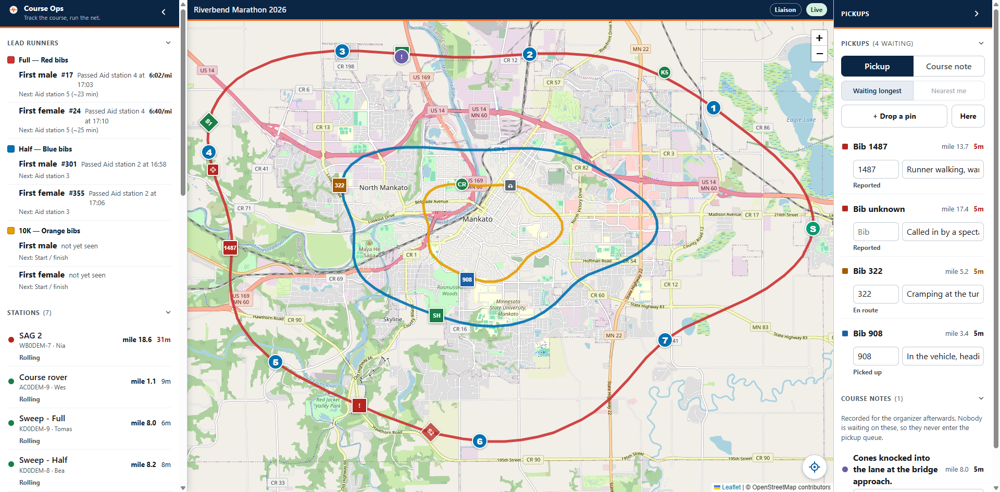

# Liaison

You sit with Public Safety and Medics. Things come to you by radio, by phone and
by somebody walking up to the desk, and your job on this screen is to put them
on the board so Net Control and SAG can see them. Read
[the basics](everyone.md) first if you have not.

> ## The radio comes first
>
> **Course Ops is supplemental. It does not replace the net.**
>
> Everything still goes over the air to Net Control - **including anything you
> enter here yourself.** Drop the pin *and* call it in. A pin is a note on a
> map; the net is where it becomes a decision somebody is accountable for.
>
> Phones lose signal in the low spots, batteries die, and a screen can be
> minutes behind without saying so. If it was not on the air, treat it as
> though nobody knows.

**You can report. You cannot work the queue.** You may open a pickup or a course
note and fill in its bib and note; moving one along its workflow, closing it or
deleting it stays with Net Control and SAG. Each row shows its status as plain
text so you can see what has been done with what you reported.

---

## Reporting what comes in

1. Press **+ Drop a pin**.
2. The panel gets out of the way and the map takes a crosshair. **Tap where the
   runner is.**
3. Type the bib and a short note on the row that appears.
4. **Call it in to Net Control on the net.** The pin does not do this for
   you, and a pickup nobody heard is a pickup nobody was assigned.

**Tapping the map is the normal way in, and that is the whole point for you.**
You are reporting places you have never seen - a location a deputy just read
over the radio. Your own position is the one position that is always wrong for
this.

**Here** exists for the rare case where the thing is in front of you. It sends
one fix, once, as that pickup's location. It is not tracking; the app has no
continuous view of where you are.

### Do not wait for the bib

Create the pickup, then fill the bib in. A call arrives before anyone can read a
number, and a pickup nobody can see is a pickup nobody is driving to.

### Keep it operational

Bib, place, and a short note about what is needed. **No medical detail.** Course
Ops is not a place to record a description of somebody's condition, and the
after-event report the organizer gets carries no names for the same reason.

### Course notes

Switch **Pickup** to **Course note** for things that are not a runner: a blocked
intersection, a signal crew that has not arrived, a turn nobody is marshalling.
Notes never enter the pickup count - that count means "people still waiting" and
must not be diluted.

---

## What you see on the map

Your map starts with the sweeps, SAG vehicles, rovers and start/finish showing,
and the aid station operators' layer switched off - your screen is about vehicles
and incidents, not the whole roster. Turn any of it back on under **People** in
the panel.

The **Lead runners** section tells you when each race's front runner passed an
aid station, and roughly when they are due at the next one. It is the counterpart
of the sweep: the leader says when a junction has to be ready, the sweep says
when it can be released.

---

## Quick answers

| Question | Answer |
|---|---|
| I reported a pickup and nothing has happened | Its status text on the row is what Net Control and SAG have done with it. Chase it on the net, not here |
| I need to cancel one I reported by mistake | Ask Net Control. Deleting is not on your link, deliberately |
| Can I see where a specific aid station is | Turn on **Aid station operators** under People, or tap the aid station pin on the map. The popup carries its What3Words address when the club entered one |
| The mile figure on a station | Where two races share road the app snaps to the nearest line, so it always tells you which race the mile is measured on |
