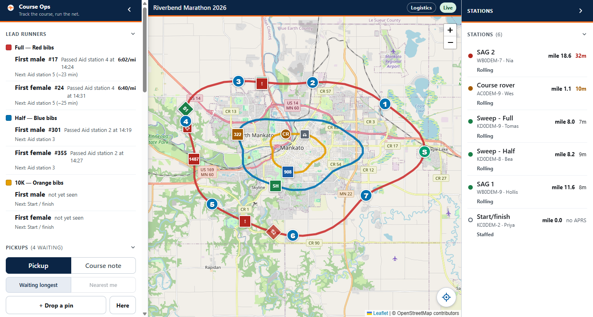
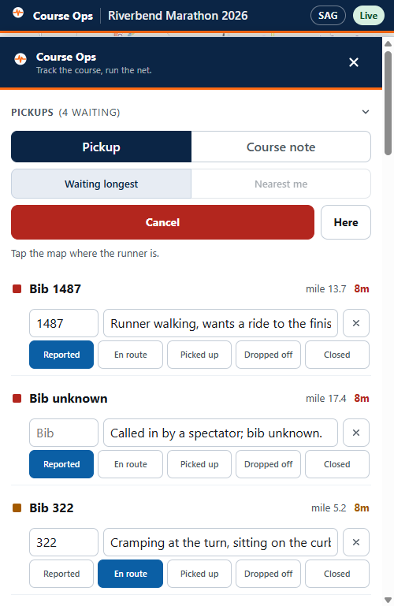

# Logistics

You are out on the course: traffic control, cones, signage, teardown. Read
[the basics](everyone.md) first if you have not.

**You can report. You cannot work the queue.** You may open a pickup or a course
note and fill in its bib and note; moving one along, closing it or deleting it
stays with Net Control and SAG.

---

## 1. Watch the sweep

The **Stations** panel is why this link exists for you.

**The sweep is the back of the pack.** When the sweep has passed your
intersection, the road behind it is clear and the cones can come up. Nothing
else on the screen tells you that.

- Sweeps are the **square** markers on the map. SAG vehicles are diamonds.
- Each row gives the sweep's position as a mile on a named course - "mile 8.0 of
  Full" - and how long since we heard it.
- Green is under 10 minutes. Amber to 20. Red past that, and a red sweep means
  the position on screen is old, not that the sweep has stopped.

Tap a row to fly the map to it.

Your map starts with the aid station operators' layer switched off, because your
screen is about vehicles moving through the course. Turn it back on under
**People** whenever you want the whole roster.

## 2. Know when a junction has to be ready

**Lead runners** tells you when each race's front runner passed an aid station,
and roughly when they are due at the next one. Between the leader and the sweep
you have the front and the back of the field, which is the whole window your
intersection has to be staffed for.

If a sighting looks impossible, the app will already be showing no pace and no
estimate rather than a wrong one - two reports seconds apart cannot produce a
useful number.

## 3. Report what you find

1. Press **+ Drop a pin**.
2. The panel gets out of the way. **Tap the map** where it is.
3. Fill in a short note - and the bib, if it is a runner.

**Here** drops it at your own position in one press, which is usually the right
one for you: you are standing at the thing. If the fix is poor the app says so
rather than letting you trust it.

Switch **Pickup / Course note** at the top:

- **Pickup** - a runner who needs collecting. It joins the queue Net Control and
  SAG work.
- **Course note** - a lane blocked, a sign down, a marshal who never arrived,
  cones knocked over at a bridge approach. No status, never in the pickup count,
  and it reaches the organizer after the event.

A runner sitting down is a **pickup**, even if you can also see the cones
problem. Report them separately.

---

## Quick answers

| Question | Answer |
|---|---|
| Can I take my cones up? | Only once the sweep for **every** race using your road has passed. Check each sweep row, not just one |
| The sweep row is red | We have not heard the radio for over 20 minutes. Do not read it as "the sweep is stopped". Ask on the net |
| A grey station | No APRS at all - most aid station operators. It is drawn at the aid station it was posted to |
| I dropped a pin in the wrong place | Ask Net Control to remove it. Deleting is not on your link |
| The map will not show my location | It needs HTTPS. On a club LAN over plain http the browser blocks it - tap the map instead |
