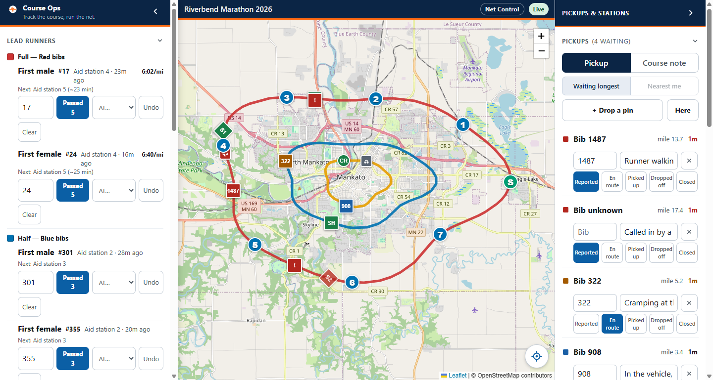
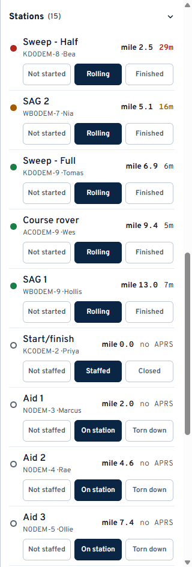
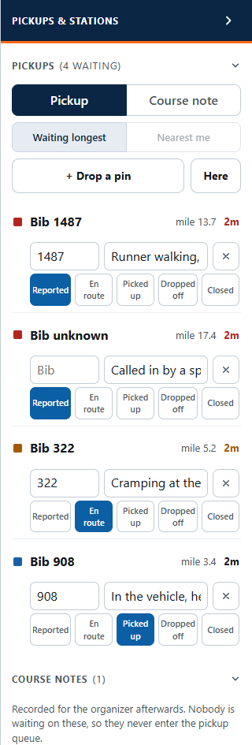
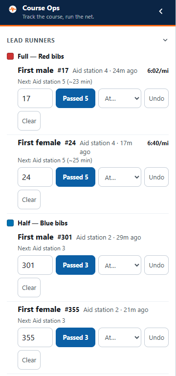
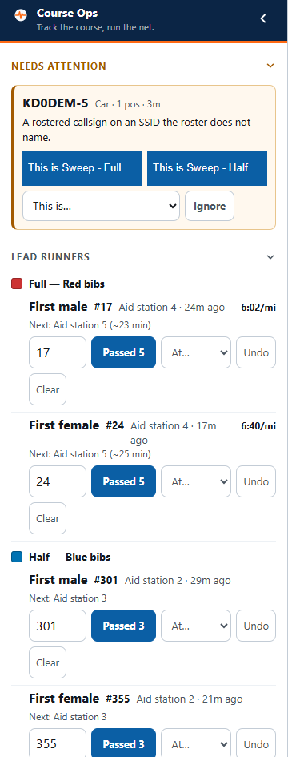

# Net Control

The link that can change everything. Read
[the basics](everyone.md) first if you have not.

> ## The radio comes first
>
> **Course Ops is supplemental. It does not replace the net.**
>
> The net is the record; this screen is a picture of it. Anything here that has
> not been on the air is unconfirmed - a pin someone dropped is a prompt to
> call them, not a report you can act on.
>
> Everything the field enters here should also reach you by radio. If it does
> not, ask for it on the net rather than working from the screen alone.

Your screen has three columns:

| Column | Holds |
|---|---|
| **Left** | Needs attention, Lead runners, Courses, People, Places, Operator |
| **Middle** | The map |
| **Right** | Pickups, Course notes, Stations - the three lists you act on |

**First thing on race morning:** put your callsign or initials in the
**Operator** box at the bottom of the left column. Every status change is
stamped with it, which is what makes a shift handover readable.

---

## 1. Station status

Each row is one roster entry: its name, callsign, the operator, how far along
the course it is, and how long since we heard it.

Set the status as it is reported on the net. The buttons are worded for the kind
of station - an aid station is *Not staffed / On station / Torn down*, a sweep is
*Not started / Rolling / Finished*.

**Two separate things are on that row and they must not be read as one:**

- The **buttons** are what the operator told you. "On station" is what you set.
- The **age** on the right is the radio. Green under 10 minutes, amber to 20,
  red past that, and grey **no APRS** for the many operators who never beacon.

"On station, no APRS" is a healthy aid station. "Rolling, 28m" is a sweep worth
a call.

Rows sort with the ones that need you at the top: closed stations sink, and
within a status they run in course order behind the sweep.

Tap a row to fly the map to that station.

---

## 2. The pickup queue

The count in the heading - **(4 waiting)** - is how many people are still on us.
Delivered and closed do not count; *picked up* still does, because that runner is
in a vehicle and still ours.

Sorting is status first, longest-waiting first inside it. A pickup nobody has
dispatched sits at the top no matter how far away it is.

### Open one

1. Press **+ Drop a pin**. The panel gets out of the way and the map takes a
   crosshair.
2. Tap where the runner is.
3. The row appears at the top of the list. Type the bib and a short note.

**Do not wait for the bib.** Create the pickup first and fill the bib in when
you have it - a call comes in before anyone can read a number.

Use **Here** only when you are standing at the spot. Net Control usually is not.

### Move one along

The buttons across the row are the workflow: **Reported, En route, Picked up,
Dropped off, Closed**. Press the one that has just happened. SAG can do this
too, from the vehicle.

**Closed** covers a pickup that ended without one - the runner carried on, or a
friend collected them.

The **X** deletes the row for everyone. Delete only a report that should never
have existed; the queue is read as "who is still waiting", and clearing a real
one makes that number lie.

### Course notes

Switch the toggle from **Pickup** to **Course note** and drop a pin the same
way: a blocked intersection, a confusing turn, a marshal who never arrived.
Notes have no status and never appear in the pickup count. They go to the
organizer after the event.

---

## 3. Lead runners

There is no tracker on the front runner. This is a log of what aid stations
report, and the position, pace and estimate are worked out from it.

When a station reports the leader through:

1. Type the bib in the box, if you have it.
2. Press **Passed <station>** - the button already names the station the leader
   is expected at next.
3. If they were sighted somewhere else, pick it from the **At...** list instead.

The panel then reads *Next: Aid station 5 (~23 min)*. If two reports arrive
seconds apart, the app shows no pace and no estimate at all rather than
publishing "120 mph" and an aid station planning around it.

- **Undo** removes the last sighting - for a mis-tap.
- **Clear** empties that race and leader - for the morning, when the panel is
  carrying a rehearsal. It is scoped to one race and one leader, so clearing
  the 10K cannot touch the Full.

You get one row per race per leader. Most events track a first male and a
first female, but the list is the club's: if your race awards a wheelchair
division or a first junior, whoever set the event up can add it under
**Setup -> Leaders**, and the new row appears on this
panel without anyone reloading.

There is no "finished" state. A later sighting is the correction.

---

## 4. Needs attention

This section appears when something is heard that the roster does not recognise.
That is normally one of two things:

- **A rostered callsign on a different SSID.** The volunteer signed up as `-9`
  and is beaconing from `-5`. Without this they would be invisible all day and
  nothing would say why.
- **A station near the course we do not know.** Somebody's mobile driving past,
  or a digipeater.

You have three answers:

1. **This is <name>** - the quick buttons, when the callsign matches a roster
   entry. It binds that radio to that person.
2. **This is...** - the full roster list. Use it when the person with the radio
   is not the person whose callsign is on the roster, which happens often.
3. **Ignore** - keeps it off the map for this event. Ignored stations are listed
   under **Ignored** in the left column and can be brought back.

The app will not let you bind a station whose APRS symbol says it is a
digipeater or an igate. Binding an aid station to somebody's home igate parks
that operator at their house for the whole race, confidently and wrongly.

Only you see this section. Nobody else's link receives it.

---

## Quick answers

| Question | Answer |
|---|---|
| An operator says they are on the air, but the row is red | Their radio is on an SSID the roster does not name. Look at **Needs attention** |
| A station shows a mile figure I do not believe | Where races share pavement the mile is snapped to whichever line is nearest. The race name always travels with it - check which race it says |
| No mile figure at all | They are too far from every course for the number to mean anything. Nothing beats a wrong number here |
| I renamed something in setup and the field still sees the old name | It should not - every setup change pushes out to everyone. Check the connection badge on the field phone |
| Someone lost their link | Any officer holding it can send it again. It is a link, not an account |
