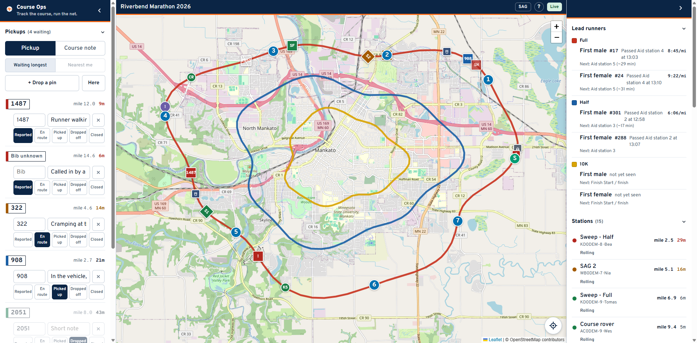
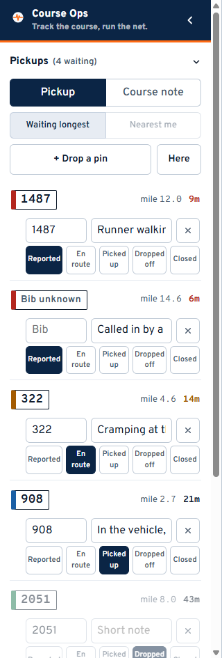

# SAG

You drive the course and collect runners who cannot finish. The pickup queue is
your screen. Read [the basics](everyone.md) first if you have not.

> ## The radio comes first
>
> **Course Ops is supplemental. It does not replace the net.**
>
> Everything still goes over the air to Net Control - **including anything you
> enter here yourself.** Drop the pin *and* call it in. A pin is a note on a
> map; the net is where it becomes a decision somebody is accountable for.
>
> Phones lose signal in the low spots, batteries die, and a screen can be
> minutes behind without saying so. If it was not on the air, treat it as
> though nobody knows.

**The queue is on the left, next to your hand.** The right-hand panel is
reference only: where the lead runners are, and where the other stations are.

---

## The queue

Each row is one runner, led by the bib number set like a race bib - the
thing you match against the runner in front of you. The coloured band on its
left is the row's status. The count in the heading is how many are still on us -
**picked up still counts**, because they are in your vehicle and not yet
delivered.

The buttons across the row are the workflow. Press the one that just happened:

| Button | Means |
|---|---|
| **Reported** | Called in, nobody dispatched |
| **En route** | You are on your way to them |
| **Picked up** | They are in the vehicle |
| **Dropped off** | Delivered |
| **Closed** | Off the board without a pickup - they carried on, or somebody else collected them |

Press **En route** as you start moving, and say so on the net. Between them that
is what stops two vehicles being sent to the same runner - the button alone only
reaches whoever happens to be looking at a screen.

## Which one to take next

Rows sort by status first, longest-waiting first inside it. That order is
deliberate: sorting purely by distance buries a runner who has been sitting for
twenty minutes.

**Nearest me** re-sorts within each status by how far each pickup is from you.
Press the crosshair button on the map first so the browser knows where you are;
until then the button is greyed out and says so.

The distance on each row is straight-line and labelled *away*. **It is not a
drive time.** There is no routing in this app - a pickup 0.4 mi away across a
river is not four hundred metres of driving.

## Filling in the bib

Type it in the box on the row when you can read it. That is usually when the
runner is in front of you, which is exactly why the report was created without
it.

Keep the note operational: where they are, what you need. **No medical detail** -
this app is not a place for a description of somebody's condition.

## Reporting one yourself

You will see runners nobody has called in.

1. Press **+ Drop a pin**. The panel gets out of the way.
2. Tap the map where they are.
3. Fill in the bib and a short note.
4. **Call it in to Net Control on the net**, the same as you would with no
   app at all.

**Here** does the same thing at your own position - use it when you are stopped
beside them. The app tells you if the fix is poor rather than letting you trust
it.

Switch **Pickup / Course note** at the top if what you found is not a runner:
cones knocked into a lane, a turn nobody is marshalling. Notes never enter the
pickup count.

## Deleting

The **X** removes a row for everyone, on every screen. Use it for a report that
should never have existed - a duplicate, a mis-tap. A runner who was collected
some other way is **Closed**, not deleted.

## On the road

- Add the link to your home screen so it opens full screen.
- The **Layers** button at the bottom raises and drops the queue.
- If the badge says **Reconnecting**, you are looking at old data. It comes back
  on its own; do not act on the list until it says Live.
- Your own position never leaves your phone. Nothing on the net can see where
  your vehicle is unless you are beaconing APRS, which is a separate thing your
  radio does.
