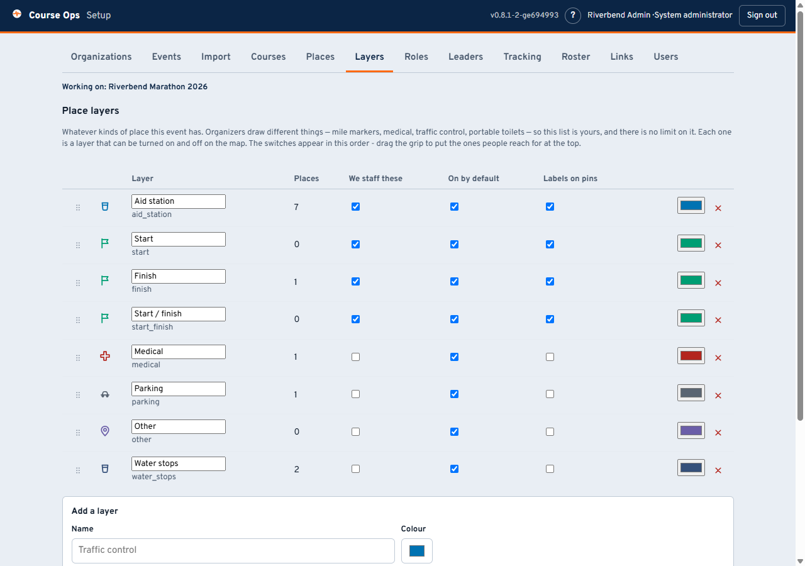
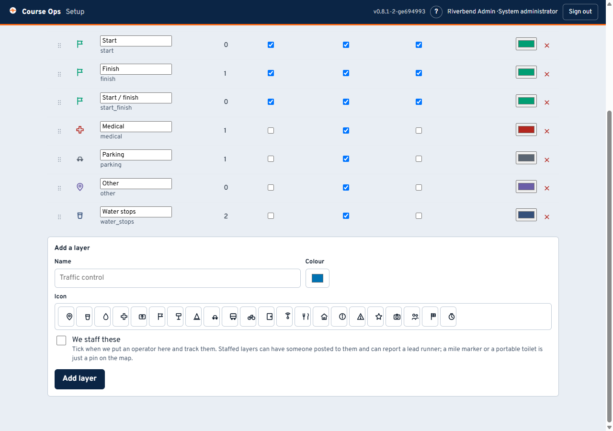
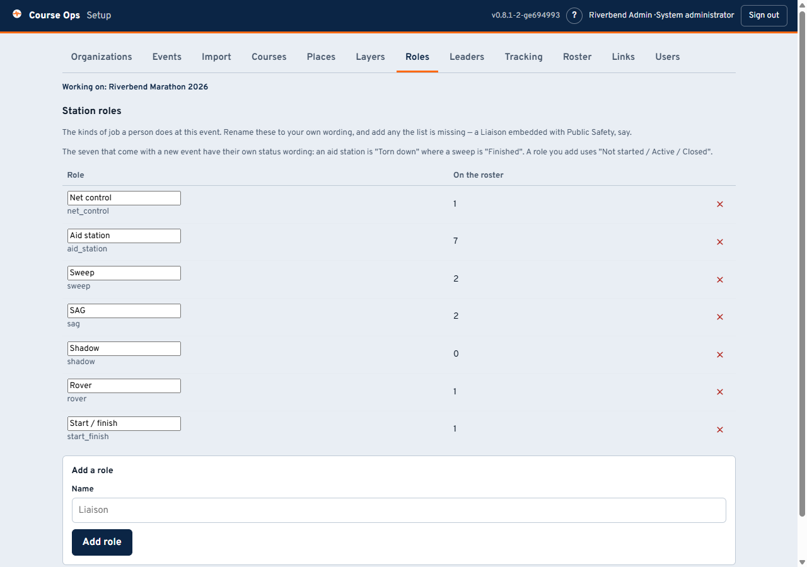

# Making it yours

The parts of Course Ops with no fixed list - **place layers**, **station
roles**, **races** and **links** - are where it either fits how your club works
or it does not. None of them are discovered by reading a form, so this page is
the tour.

> **Setting up, in four parts**
> 1. [The course](setup.md) - events, import, courses, places
> 2. [Roster and links](setup-people.md) - the people, and how they get in
> 3. [Race week and after](setup-race-week.md) - tracking, the rehearsal, the report
> 4. **Making it yours** - you are here

---

## Place layers: this list is yours

**There is no fixed list of place types.** Aid station, medical, parking and the
rest are a starting point, not a limit. Rename them, delete them, add as many as
you want. A layer is a switch on everyone's map, so a club can put things on the
map that only matter for an hour and turn them off after.

Each layer gets a name, a colour, an icon, and three switches:

| Switch | What it decides |
|---|---|
| **We staff these** | Whether an operator can be posted here, a lead runner sighted here, and a what3words address is worth keeping. This is the one that matters |
| **On by default** | Whether the layer starts switched on. Turn it off for a 26-marker mile layer |
| **Labels on pins** | Characters on the pin instead of the icon. Good for a dozen aid stations, terrible across fifty mile markers |

Renaming a layer is always safe - no place has to move, because the name is
display only. Deleting one that still has places in it is refused, rather than
leaving those places in the database and off the map with nothing to say why.

## Station roles: also yours

Rename *Rover* to *Floater* if that is what your club says on the air. Add one
the list is missing - Liaison is the obvious example, and it is why the list
stopped being fixed. Renaming is safe for the same reason: nothing keys off the
displayed name.

---

## What else you can do with this

**Map anything the net asks about.** Layers are just named, coloured, icon'd
sets of points. Traffic control posts. Road closures. Portable toilets, so the
most-asked question on any net has an answer on a map. Shelter and warming
points. Spectator crossings. Photo positions. Hazards found during the course
walk. Turn a layer off when it stops being interesting and it is out of
everyone's way without being deleted.

**Staff the layers that hold people, not the ones that hold objects.** *We staff
these* is the switch that lets an operator be posted somewhere and a lead runner
be sighted there. A club that puts a person on every traffic control point
should tick it for that layer - and the whole progression, posting and status
machinery starts working there too.

**It is not only marathons.** Anything with a route, points along it, and
volunteers on radios fits: a bike tour with rest stops, a walkathon, a parade
route with intersection posts, a triathlon's run leg, a ski loppet, a public
service exercise with checkpoints. Rename "Aid station" to "Rest stop" or
"Checkpoint" and the rest of the app follows the new wording.

**It works with no APRS at all.** Leave tracking off, mark everyone *no APRS*,
and you still have the course, the places, the roster with live status, the
pickup queue, course notes and lead runners. Positions are one feature, not the
foundation - a club with handhelds and no trackers still gets most of this.

**Lead runners are per race, and which leaders you track is yours.** A new
event comes with *First male* and *First female*; **Setup -> Courses ->
Leaders we track** is where you rename them, add a wheelchair leader or a first
junior, or delete one your race does not award. Each race gets its own
progression and its own bib colour, so a three-race event is three
progressions rather than one confused one.

Bear the arithmetic in mind before adding a fourth: Net Control sees one row
per race per leader, so three races and two leaders is six rows, and three
races and four leaders is twelve. Track what will actually be called in on the
net. Reports are recorded against a leader, so one that has already been
sighted has to have its sightings cleared before it can be deleted - and
renaming is always safe, because reports follow the leader, not the wording.

**Give the organizer the Staff link early.** It is read-only, it is safe to
forward to people the club has never met, and a race director watching the sweep
move on their own phone asks you far fewer questions.

**Run a rehearsal event.** Make a second event, import last year's files, hand
out its links, and let people tap through it on their own phones before race
week. Nothing in it touches the real one - every table in the app is scoped to
its event.

**Several people can hold one role.** A link works on any number of phones, so
three Net Control operators on three screens is a supported way to run a big
net; they see each other's changes as they happen. Give them
[a link each](setup-people.md) when you want to be able to revoke one of them.

**Next year, start a new event.** Import the same files, build the roster again,
issue fresh links. Last year's event stays exactly as it was, report and all.

---

Back to [the walkthrough](setup.md), or the [volunteer guides](Home).
