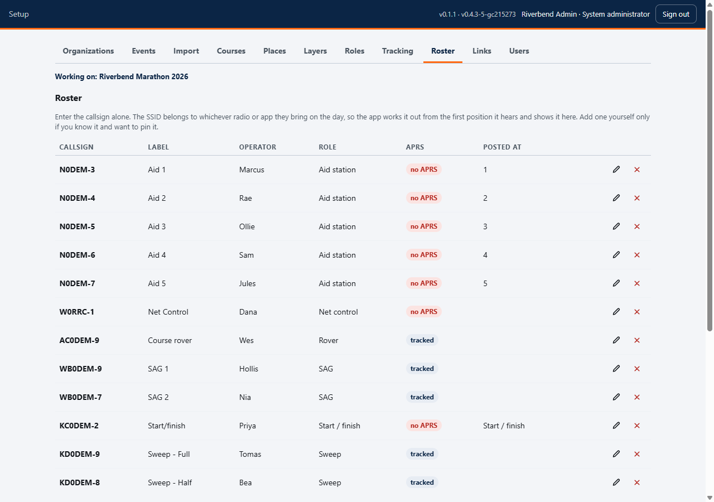
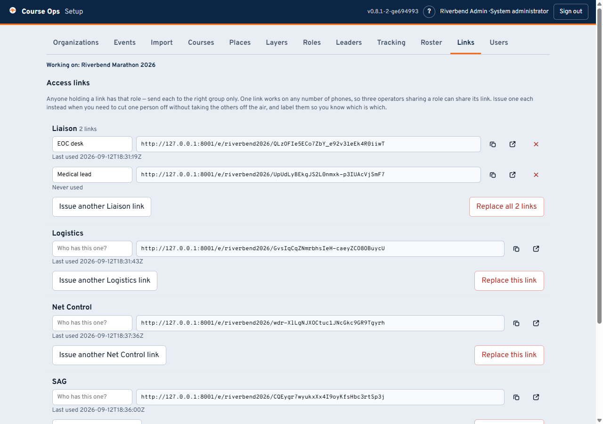

# Setting up an event: roster and links

Who is out on the course, and how each of them gets into the app.

> **Setting up, in four parts**
> 1. [The course](setup.md) - events, import, courses, places
> 2. **Roster and links** - you are here
> 3. [Race week and after](setup-race-week.md) - tracking, the rehearsal, the report
> 4. [Making it yours](setup-ideas.md) - layers, roles, and what else this can do

---

## The roster

Three separate things, and confusing them is the most common mistake:

1. **The place** - an aid station, from the course file.
2. **The operator** - a person with a callsign, on this tab.
3. **A position report** - only if they beacon APRS. **Most aid station
   operators never will**, and that is normal.

So mark **no APRS** for anyone not beaconing. It is not "ignore them" - they
still appear, still get a status, still get posted at a place and drawn there.
It means "do not warn me that they are quiet", which is what keeps the quiet
list worth reading at all.

**Enter the callsign alone.** The SSID belongs to whichever radio or phone app
they bring on the day; ask a coordinator to collect it in advance and you will be
told the wrong one. The app learns it from the first position it hears, and Net
Control can match a station to the right person in one tap on the day.

**Post people at places.** An operator posted to an aid station is drawn there
even though they never transmit, and sorts into course order with everyone else.
That is the only way a handheld-only operator appears in the right place.

The role list is the club's own - rename or add to it on the
[Roles tab](setup-ideas.md).

---

## Links

One link per role, and **one link works on any number of phones** - three Net
Control operators can share one and all three will see each other's changes.

Issue a link each instead when you want to be able to cut one person off without
taking the others off the air: a phone left in a parking lot, an operator who has
gone home. Label each one with whose it is - that label is what you will look
for when you need to revoke in a hurry, because the links themselves are
random strings and two of them side by side are indistinguishable.

- The red **x** revokes one link. Every other link for that role keeps working.
- **Replace all** revokes every link for the role at once - for when the role is
  compromised, not one phone.

### Which link to whom

| Link | Goes to |
|---|---|
| **Net Control** | Whoever is running the net. Everything is editable from here |
| **SAG** | The vehicles collecting runners. They work the pickup queue |
| **Liaison** | Whoever sits with Public Safety and Medics. Report only |
| **Logistics** | Traffic control, cones, teardown. Report only, and they watch the sweep |
| **Staff** | The organizer and race staff. Read-only, and the one that is safe to forward |

**Send each volunteer [their guide](Home) along with their link.** They are one
page each, written for the phone they will be holding.

> **The links are the login.** Anyone holding one has that role, so they are
> treated like door keys - sent to the right group and no other. Nothing is lost
> if someone's phone dies: any officer holding the link can send it again.

---

**Next:** [Race week and after](setup-race-week.md) - turning tracking on, the
rehearsal that is worth an hour, and what the organizer gets afterwards.
