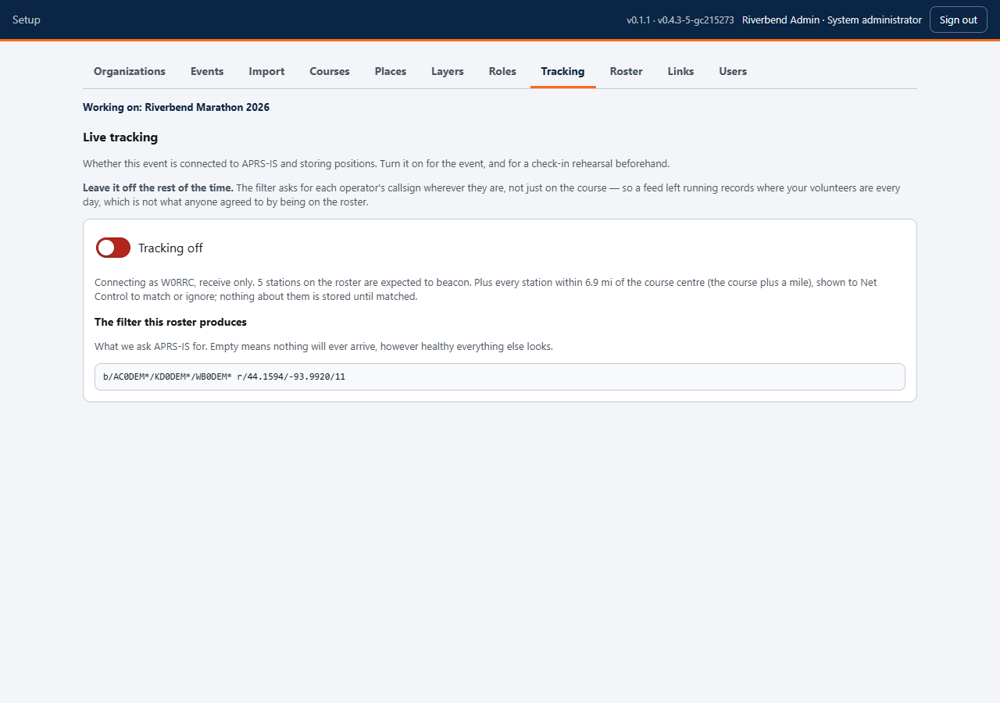
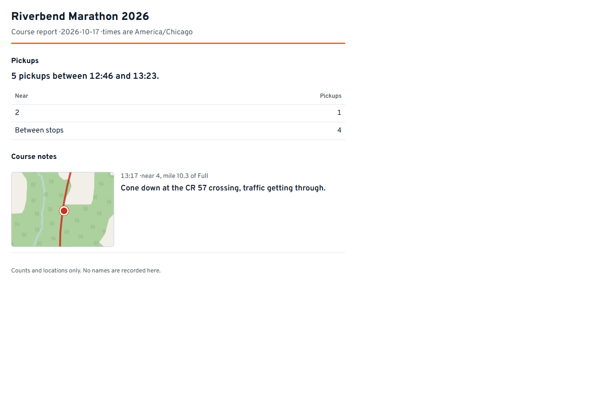

# Setting up an event: race week and after

Turning the feed on, the rehearsal that is worth an hour, and what the organizer
gets when it is over.

> **Setting up, in four parts**
> 1. [The course](setup.md) - events, import, courses, places
> 2. [Roster and links](setup-people.md) - the people, and how they get in
> 3. **Race week and after** - you are here
> 4. [Making it yours](setup-ideas.md) - layers, roles, and what else this can do

---

## Tracking

The APRS-IS feed is **off until somebody turns it on**, and that is a privacy
decision rather than a performance one. The filter asks for each operator's
callsign *wherever they are*, not only on the course - so a feed left running
all year records where your volunteers live and work, which is not what anyone
agreed to by joining a roster.

Turn it on for race day, and for a check-in rehearsal the week before.

The tab shows the exact filter your roster produces. **An empty filter means
nothing will ever arrive**, however healthy everything else on the screen looks -
which is the failure that is hardest to spot on race morning, because a quiet
feed and a quiet net look identical.

## A check-in rehearsal is worth an hour

Turn tracking on a week out and ask everyone who will beacon to do so. What it
finds:

- **Who is on a different SSID than the roster says.** Net Control matches them
  in one tap, and it is far easier to do on a Tuesday than at 06:30.
- **Who cannot get into the network at all** from where they will be standing.
- **Whether your filter is right** - see above.

A wrong SSID makes somebody invisible on race day with no error message
anywhere on any screen. This is the hour that prevents it.

## On the day

Start the server, open the map on the Net Control workstation, and check:

- [ ] The connection badge top-right reads **Live**
- [ ] The courses and places are drawn
- [ ] Tracking is **on**
- [ ] At least one mobile station appears within a few minutes

**If the setup screen shows an orange "New version - reload"**, the server has
been updated since you opened that page. Press it when you are between jobs -
it reloads, nothing else. It appears only here, on the setup screen: the
volunteers' pages do not carry it, because there is nothing useful they could
do about it mid-event, and a prompt nobody can act on is the last thing anyone
needs on race morning.

If an update matters to the people in the field, tell them on the net to
reload. That is the same relay everything else in this app uses.

The full event-day procedure - what Net Control does through the morning, and
what to do when something breaks - is in
[`docs/RUNBOOK.md`](../RUNBOOK.md) in the repository.

---

## After the event

Every event row has an **After-event report** link. It carries counts, places,
times and course notes with **no volunteer names**, because it goes to the race
organizer, who needs to know that four runners were collected and where - not
which of your members reported it.

The small maps on it are drawn by the browser from the same tiles as the live
map, so nothing about an incident is sent anywhere the live map does not already
send it.

---

## Two rules worth carrying

**Setup changes reach the field immediately.** Rename a station here and every
phone holding a link updates itself. There is no "publish" step and no reason to
tell anyone to refresh.

**The app is supplemental to the net.** It does not replace the radio, and every
guide you hand out says so on its first screen. Build the event so that a phone
running flat costs somebody convenience, not information.

---

**Next:** [Making it yours](setup-ideas.md) - the parts with no fixed list, and
what clubs can do with them.
