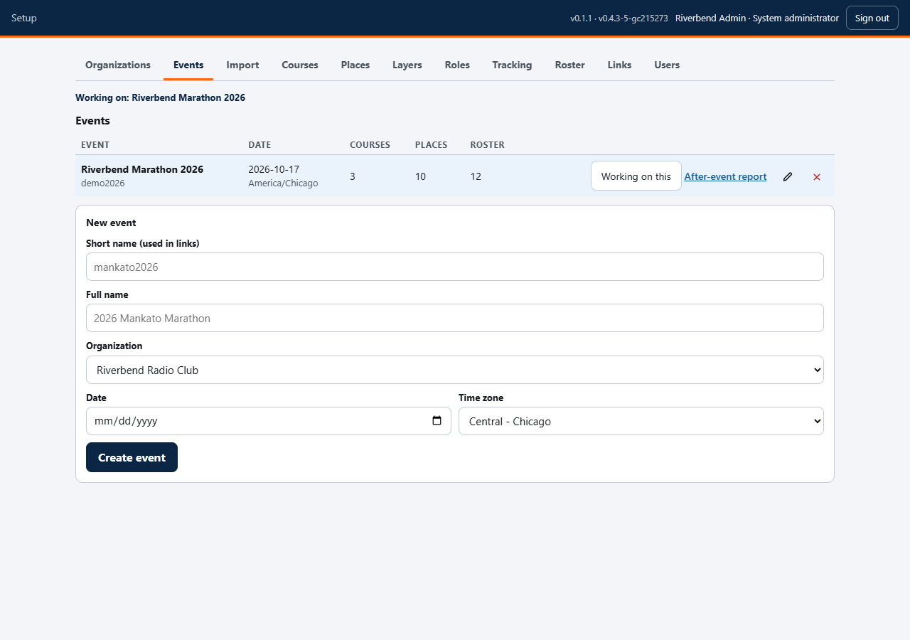
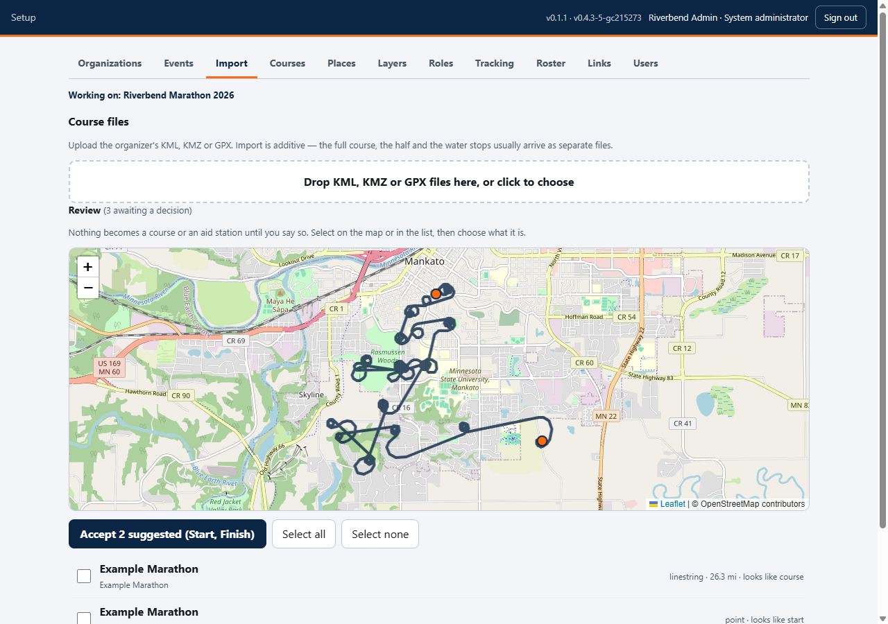
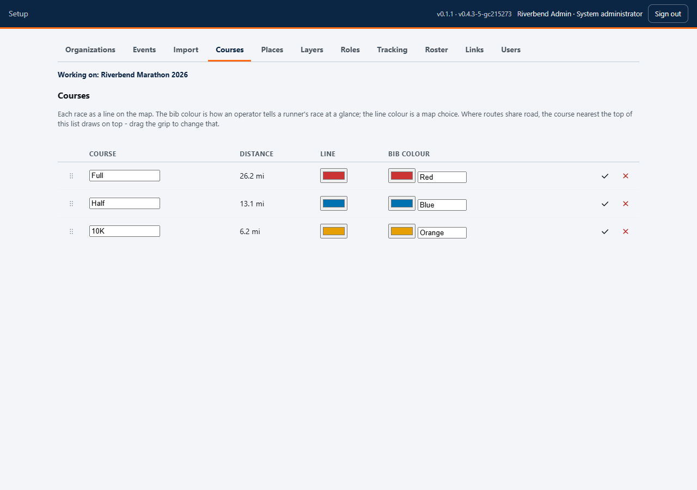
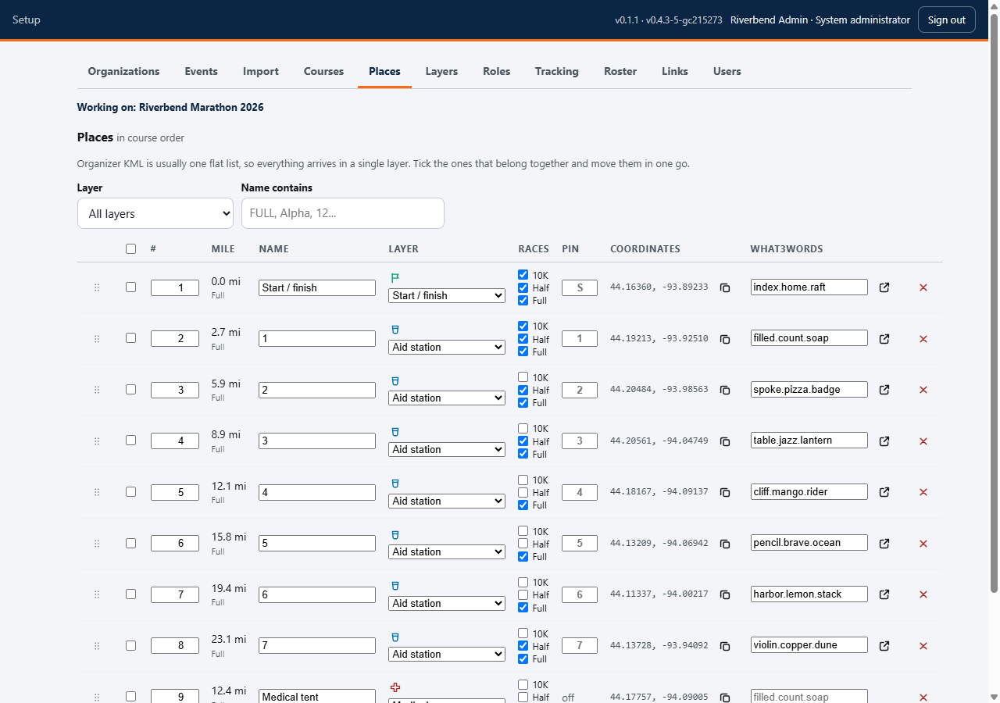

# Setting up an event

For the club officer who stands the event up, not the volunteer holding a link.
The volunteers' pages are [here](Home).

**Everything on this page happens in a browser at `/setup`.** Two things stay in
a terminal and nothing else: your club callsign in a file called `.env`, and
starting the server.

The tabs run roughly in the order you will use them. Every tab except
Organizations, Events and Users belongs to **one event** - the one named in
*Working on:* at the top.

---

## Before race week

### 1. Organizations, then an event

An **organization** is your club. It owns its events and its administrators and
cannot see another club's - so a second club on the same server is properly
walled off, not just tidily separated.

Then **Events**: a short name, a full name, the date, and the time zone. Get the
time zone right, because every clock in the app and in the after-event report is
drawn in it.

> **The short name is permanent.** It is in `/e/<short-name>/<link>`, which means
> it is in every link you have handed out. The full name can be changed whenever
> you like; the short name cannot, because changing it would 404 every volunteer
> at once, silently, on the morning they need it.

### 2. Import the course

Drop in the organizer's **KML, KMZ or GPX**. Import is additive - the full
course, the half and the water stops usually arrive as three separate files from
three different tools.

**Nothing becomes a course or a place until you say so.** Everything lands in a
review list, drawn on a map, and you classify it. That is deliberate: organizer
files routinely contain a parking lot named the same as the route, and a
suggestion confident enough to file it as an aid station would be wrong in a way
nobody notices until race day.

The screenshot above is a real export's defects: three placemarks, all named
"Example Marathon", one of them the route and two of them markers. The app says
*looks like course* and *looks like start* and leaves the decision to you.

**Look at the map before you assign anything.** A course split into five
segments, a stray line miles from the route, or a start marker in the wrong car
park is obvious there and invisible in a list of names.

### 3. Courses: colours and draw order

Each race gets a line colour and a **bib colour**, which are two different
things: the line colour is a map choice, the bib colour is how an aid station
operator says *"first yellow male just came through"*.

Where routes share pavement, the course nearest the top of this list draws on
top. Drag the grip to change it. That is the order everyone starts with; any
viewer can re-stack their own screen without affecting anybody else.

**Check the distance.** If a course reads 3 mi when it should read 13, segments
are missing or one belongs to a different route.

### 4. Places

Every point on the map lives here. What each column is for:

- **#** - the club's own running order. Geometry cannot work this out once an
  event has more than one route: each place snaps to whichever line is nearest,
  and where races share road that is a coin flip. Drag or type to set it.
- **Layer** - which kind of place this is. Change one, or tick several and move
  them together, which is what you will do after an import (organizer files
  arrive as one flat list).
- **Races** - which races this stop serves. State it; do not let it be guessed.
  One water stop routinely serves three races - the organizer's file will
  literally say "WATER (ALL)" - and guessing drops it from every race whose line
  happens to run further away.
- **Pin** - the one or two characters drawn on the pin. Derived from the name,
  and only worth typing when the guess comes out wrong.
- **what3words** - optional, typed in by hand. Aid stations sit at park
  entrances where a street address is useless.

### 5. Layers and roles: this list is yours

**There is no fixed list of place types.** Aid station, medical, parking and the
rest are a starting point, not a limit. Rename them, delete them, add as many as
you want.

Each layer gets a name, a colour, an icon, and three switches:

| Switch | What it decides |
|---|---|
| **We staff these** | Whether an operator can be posted here, a lead runner sighted here, and a what3words address is worth keeping. This is the one that matters |
| **On by default** | Whether the layer starts switched on. Turn it off for a 26-marker mile layer |
| **Labels on pins** | Characters on the pin instead of the icon. Good for a dozen aid stations, terrible across fifty mile markers |

**Station roles are yours too.**

Rename *Rover* to *Floater* if that is what your club says. Add one the list is
missing - Liaison is the obvious example. Renaming is always safe: nothing in
the app keys off the displayed name.

### 6. Roster

Three separate things, and confusing them is the most common mistake:

1. **The place** - an aid station, from the course file.
2. **The operator** - a person with a callsign, on this tab.
3. **A position report** - only if they beacon APRS. **Most aid station
   operators never will**, and that is normal.

So mark **no APRS** for anyone not beaconing. It is not "ignore them" - they
still appear, still get a status, still get posted at a place and drawn there.
It means "do not warn me that they are quiet", which is what keeps the quiet
list worth reading.

**Enter the callsign alone.** The SSID belongs to whichever radio or phone app
they bring on the day; ask a coordinator to collect it in advance and you will be
told the wrong one. The app learns it from the first position it hears.

### 7. Links

One link per role, and **one link works on any number of phones** - three Net
Control operators can share one.

Issue a link each instead when you want to cut one person off without taking the
others off the air: a phone left in a parking lot, an operator who has gone
home. Label each one with whose it is; that label is what you will look for when
you need to revoke in a hurry, because the links themselves are random strings.

- The red **x** revokes one link. Every other link for that role keeps working.
- **Replace all** revokes every link for the role at once - for when the role is
  compromised, not one phone.

Send each volunteer [their guide](Home) along with their link.

---

## Race week

### Tracking

The APRS-IS feed is **off until somebody turns it on**, and that is a privacy
decision rather than a performance one. The filter asks for each operator's
callsign *wherever they are*, not only on the course - so a feed left running
all year records where your volunteers live and work, which is not what anyone
agreed to by joining a roster.

Turn it on for race day, and for a check-in rehearsal a week before. The tab
shows you the exact filter your roster produces: **empty means nothing will
ever arrive**, however healthy everything else looks.

### A check-in rehearsal is worth an hour

Turn tracking on a week out and ask everyone who will beacon to do so. What you
find:

- Who is on a different SSID than the roster says (Net Control matches them in
  one tap, and it is far easier on a Tuesday).
- Who is not getting into the network at all from where they will be standing.
- Whether your filter is right.

A wrong SSID makes somebody invisible on race day with no error message
anywhere. This is the hour that prevents it.

---

## After the event

Every event row has an **After-event report** link. It carries counts, places,
times and course notes with **no volunteer names**, because it goes to the race
organizer, who needs to know that four runners were collected and where - not
which of your members reported it.

---

## What else you can do with this

The parts most worth bending are the ones with no fixed list: **place layers**,
**station roles**, **races** and **links**. A few directions clubs have room to
go:

**Map anything the net cares about.** Layers are just named, coloured, icon'd
sets of points. Traffic control posts. Road closures. Portable toilets, so the
answer to the most-asked question on any net is on a map. Shelter and warming
points. Spectator crossings. Photo positions. Hazards found during the course
walk. Turn a layer off when it stops being interesting, and it is out of
everyone's way without being deleted.

**Staff the layers that hold people, not the ones that hold objects.** *We staff
these* is what lets an operator be posted somewhere and a lead runner be sighted
there. A club that puts a person on every traffic control point should tick it
for that layer, and suddenly the whole progression works there too.

**It is not only marathons.** Anything with a route, points along it and
volunteers on radios fits: a bike tour with rest stops, a walkathon, a parade
route with intersection posts, a triathlon's run leg, a ski loppet, a public
service exercise with checkpoints. Rename "Aid station" to "Rest stop" or
"Checkpoint" and the whole app follows.

**It works with no APRS at all.** Leave tracking off, mark everyone *no APRS*,
and you still have the course, the places, the roster with live status, the
pickup queue, course notes and lead runners. Positions are one feature, not the
foundation - a club with handhelds and no trackers still gets most of this.

**Lead runners are per race, and each race is tracked separately.** Every race
you set up gets its own first male and first female, with its own bib colour, so
a three-race event is three progressions rather than one confused one. (Those
two divisions are what the app offers today. Nothing in the database is limited
to them, but adding a third is currently a code change, not a setting - worth
asking for if your event needs it.)

**Give the organizer the Staff link early.** It is the read-only one, it is safe
to forward to people you have never met, and a race director watching the sweep
move on their own phone asks you a lot fewer questions.

**Run a rehearsal event.** Make a second event, import last year's files, hand
out its links, and let people tap through it on their own phones before race
week. Nothing in it touches the real one - every table in the app is scoped to
its event.

**Next year, start a new event.** Import the same files, build the roster again,
issue fresh links. Last year's event stays exactly as it was, report and all.

---

## Two rules worth carrying

**Setup changes reach the field immediately.** Rename a station here and every
phone holding a link updates itself. There is no "publish" step and no reason to
tell people to refresh.

**The app is supplemental to the net.** It does not replace the radio, and every
guide you hand out says so on its first screen. Build the event so that a phone
running flat costs somebody convenience, not information.
