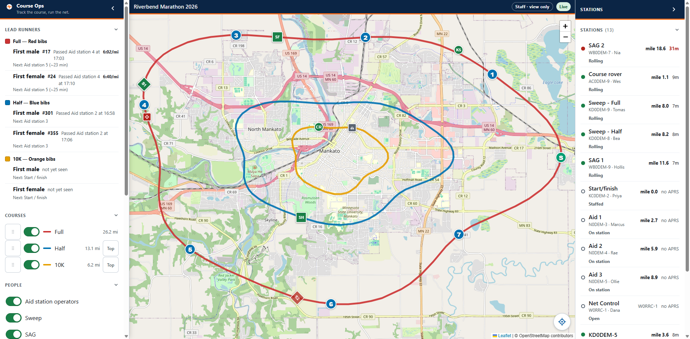

# Staff

The view-only link. Race staff, the organizer, anyone who should see the whole
picture and change none of it. Read [the basics](everyone.md) first if you have
not.

> ## The radio comes first
>
> **Course Ops is supplemental. It does not replace the net.**
>
> What you see here is a picture of what the net has reported, and it can be
> minutes behind. Nothing on this screen is an instruction, and reporting
> something you notice is not done by looking at it - it goes to Net Control by
> radio, through whoever is your contact on the net.

Your badge says **Staff - view only**. That is exactly what the link does: every
layer, every station, the lead runners, and no button that changes anything.

**This is the link that gets forwarded.** It is safe to hand to somebody the
club has never met, which is why it can do nothing.

---

## What you get

| Section | Tells you |
|---|---|
| **Lead runners** | Where each race's front runner was last reported, at what time, and roughly when they are due at the next aid station |
| **Courses** | Every race, its distance, and a switch to show or hide its line |
| **Stations** | Every operator on the roster: where they are, whether they are on station, and how long since we heard them |
| **People / Places** | Which kinds of station and which kinds of place are drawn on the map |

Tap any station row, pin or marker to fly the map to it and read its detail.

## What you do not get

**Pickups and course notes are not on your link.** They are not hidden from you
by accident and they are not sent to your browser at all.

The reason is that a pickup queue is read as "who is still waiting". A partial
or forwarded view of it turns into a wrong count somebody acts on, and this link
travels further than any of the others. The organizer gets the numbers - counts,
places, times, no volunteer names - in the after-event report the club produces
from the setup pages.

You also do not see the "needs attention" list of unknown callsigns heard around
the course. That is Net Control's problem and nobody else's.

---

## Reading the screen

- **Grey stations are normal.** Most aid station operators carry handhelds with
  no APRS at all. They are drawn at the aid station they were posted to.
- **Green / amber / red** on a station is only *how long since the radio was
  heard* - under 10 minutes, under 20, over 20. It is not whether the aid
  station is staffed. The words on the row - "On station", "Rolling", "Torn
  down" - are what the operator actually reported.
- **Markers jump** between positions minutes apart. Nothing is animated between
  two reports, because a smooth line would show a position nobody ever sent.
- A mile figure always names the race it is measured on, because the races share
  road.

## If you need to change something

You cannot, from this link, and that is the design. Ask Net Control on the net,
or the club officer who runs the event setup.
