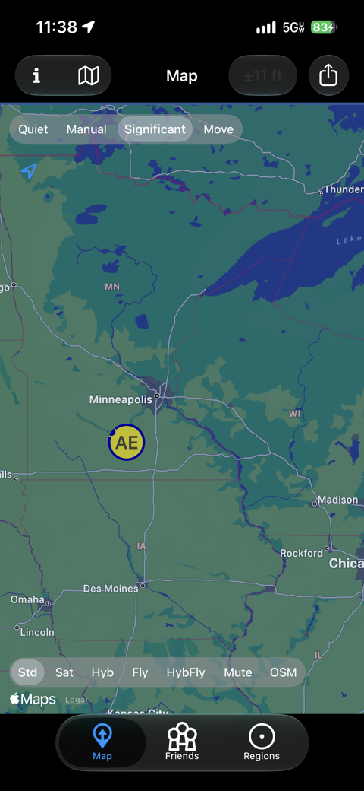
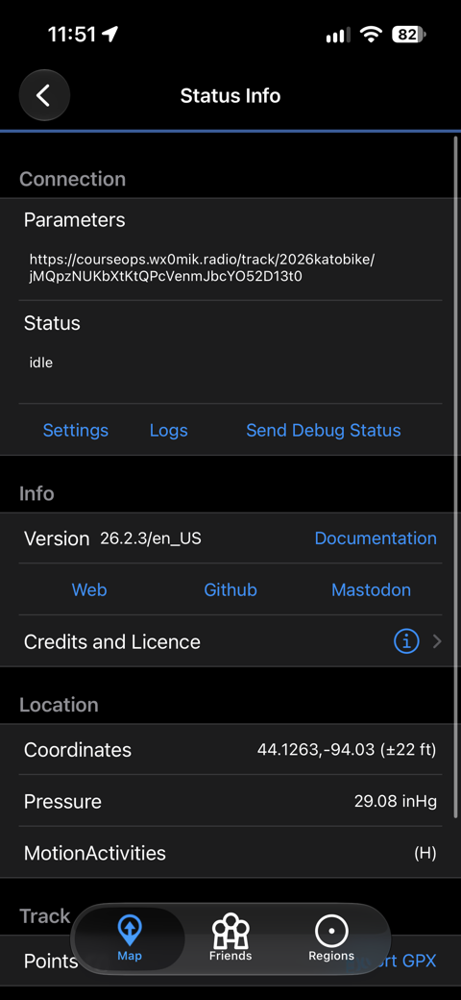
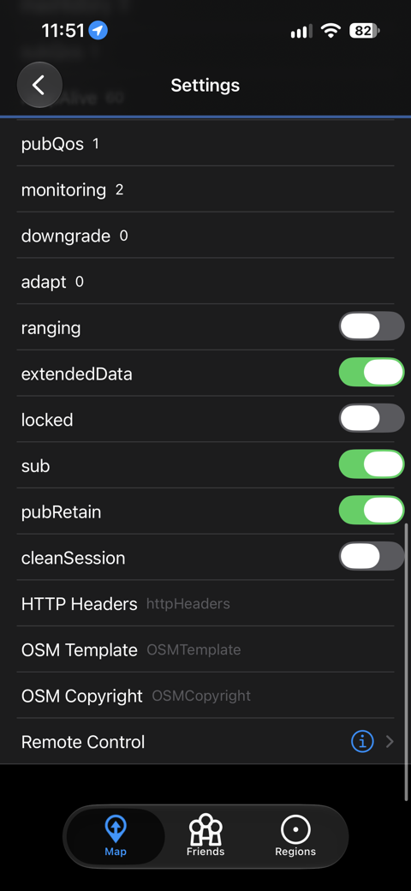
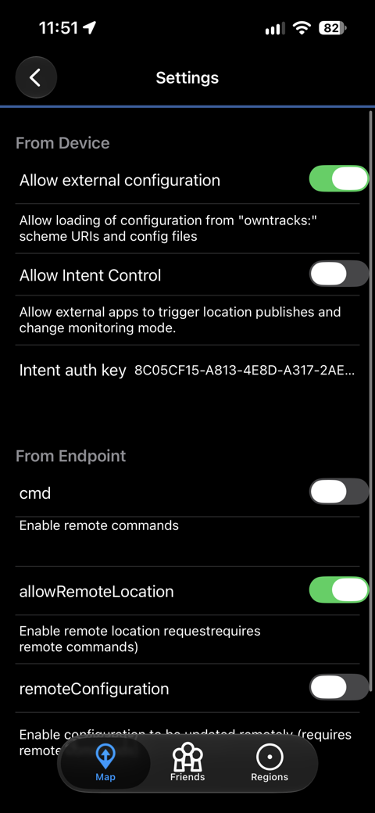

# Being tracked by your phone

For bike medics, race staff and drivers without a ham callsign. Net Control
needs to know where you are so they can send you to a runner who needs help.
A free app on your own phone does that; this page is the five minutes it
takes to set up.

> ## Before you start
>
> This shares your location with the event's Net Control **while the app is
> running.** Nobody else sees it, and it stops the moment you turn the app
> off. Only your **latest** position is kept - each new one replaces the last,
> so there is no record of where you have been, only where you are. If you
> are not comfortable with that, say so - nobody will mind.

## 1. Install OwnTracks - do this at home, the week before

**OwnTracks** is free, open source, and on both stores:

- iPhone: App Store, search *OwnTracks*
- Android: Google Play, search *OwnTracks*

Do it before the day. The code on the card does nothing on a phone that does
not have the app yet, and the briefing table is not the place to wait for a
download.

When it asks for location permission, choose **Always** (or *Allow all the
time*). "While using the app" means it stops the moment your phone goes in
your pocket, and that is the whole reason for the app.

## 2. Let the app accept a configuration

OwnTracks refuses configuration links unless you say it may take them - a
sensible default, since a link can reconfigure the whole app. Once, before
you scan:

1. On the map screen, tap the **i** button at the top left.

   

2. That opens **Status Info**. Tap **Settings**, under the Connection box.

   

3. Scroll all the way to the bottom of Settings and tap **Remote Control**.

   

4. Turn on **Allow external configuration** (the first switch) and confirm
   the warning. Leave the other switches alone.

   

Skip this and scanning the card shows *URI or file configuration not
allowed* and does nothing.

## 3. Scan the card

The club will have a printed card, or send you a picture of it. Point your
phone camera at the code and tap the link that appears. OwnTracks opens and
applies the configuration.

To check it took: **i** → **Status Info** should now show the event's
address under *Connection - Parameters* (it starts with the club's web
address and `/track/`), and the row at the top of the map switches from
*Significant* to **Move**.

## 4. Set your designator

**i** → **Settings** again. Near the top, find **Tracker ID** (the app's
two-letter default is shown on your own dot on the map) and type the
designator printed beside your name on the card - `M1`, `BIKE2`, whatever
the club chose for you. It does not change on its own.

## On the day

1. Open OwnTracks once before you start. It keeps reporting in the
   background; you do not need to keep it on screen.
2. Tell Net Control on the radio that you are on the air. They will confirm
   your dot is moving.
3. **When you are done, turn reporting off** - in OwnTracks, set the mode to
   *Quiet*, or just close the app. Location stops leaving your phone the
   moment you do.

## If Net Control cannot see you

- Did the scan actually take? *URI or file configuration not allowed*
  means step 2 was skipped - turn on **Allow external configuration** and
  scan again.
- Is the app running, and did you open it once today?
- Location permission set to **Always**?
- Any signal? The app keeps your positions while you are out of coverage
  and sends them when it returns - you appear late, not never.
- Ask Net Control whether an unknown phone is reporting. If you typed the
  designator differently, they can match it to you in one tap.

## Using Traccar Client instead

If you already use **Traccar Client**, it works too. In its settings, set
the **server URL** to the address printed on the card (you do type this one)
and the **Device identifier** to your designator. Everything above about
permissions and turning it off applies.

---

*Your phone's position is kept with the time it was taken, not the time it
arrived, so a gap in coverage never makes you look like you are somewhere
you left ten minutes ago. Only the newest one is kept.*
