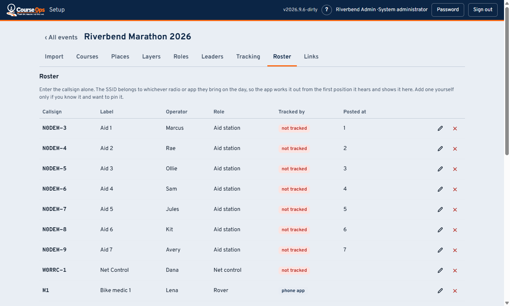
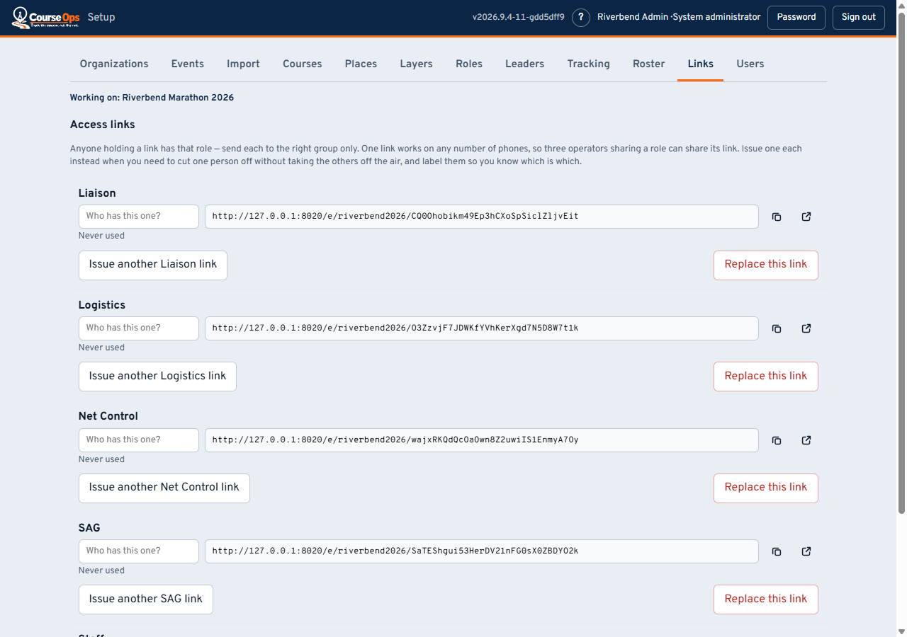

# Setting up an event: roster and links

Who is out on the course, and how each of them gets into the app.

> **Setting up, in four parts**
> 1. [The course](setup.md) - events, import, courses, places
> 2. **Roster and links** - you are here
> 3. [Race week and after](setup-race-week.md) - tracking, the rehearsal, the report
> 4. [Making it yours](setup-ideas.md) - layers, roles, and what else this can do

---

## The roster

On a phone the same table is a stack of cards, one per station, with the
pencil and the X at the bottom right of each.

Three separate things, and confusing them is the most common mistake:

1. **The place** - an aid station, from the course file.
2. **The operator** - a person with a callsign, on this tab.
3. **A position report** - only if they beacon APRS. **Most aid station
   operators never will**, and that is normal.

So set **Tracked by** to *Not tracked* for anyone not beaconing. It is not
"ignore them" - they still appear, still get a status, still get posted at a
place and drawn there. It means "do not warn me that they are quiet", which is
what keeps the quiet list worth reading at all.

**Tracked by** has three settings:

| Setting | Who | What goes in the callsign box |
|---|---|---|
| **APRS radio** | A ham who will beacon | Their callsign |
| **Phone app** | Someone with no callsign - a bike medic, race staff, a driver - running a tracking app on their phone | A short **designator** you choose: `M1`, `BIKE2`. Letters and digits, short enough to say on the air |
| **Not tracked** | An operator who will not transmit | Their callsign |

A phone entry is never asked for on APRS-IS; instead the app on their phone
posts to a link you turn on under [Tracking](setup-race-week.md#phone-tracking).
Silence still counts as an alert for them, because the whole point of tracking a
medic is knowing where they are.

**Enter the callsign alone.** The SSID belongs to whichever radio or phone app
they bring on the day; ask a coordinator to collect it in advance and you will be
told the wrong one. The app learns it from the first position it hears, and Net
Control can match a station to the right person in one tap on the day.

**Typed it wrong? Edit the row.** Changing the callsign on an existing entry
corrects it in place: the label, role, place and status history all stay with
the one row. A match Net Control made on the day survives a correction too -
it records which radio was heard, which a typo in the callsign does not change.
The edit is refused if the new callsign is already another entry's, or already
the radio another entry has been matched to.

**Post people at places.** An operator posted to an aid station is drawn there
even though they never transmit, and sorts into course order with everyone else.
That is the only way a handheld-only operator appears in the right place.

The role list is the club's own - rename or add to it on the
[Roles tab](setup-ideas.md).

---

## Links

One link per role, and **one link works on any number of phones** - three Net
Control operators can share one and all three will see each other's changes.

Issue a link each instead when you want to be able to cut one person off without
taking the others off the air: a phone left in a parking lot, an operator who has
gone home. Label each one with whose it is - that label is what you will look
for when you need to revoke in a hurry, because the links themselves are
random strings and two of them side by side are indistinguishable.

- Under each link, **Last used** is when a phone last opened it, in the
  event's time zone - the clue to which of three links is the one left in the
  parking lot.
- The red **x** revokes one link. Every other link for that role keeps working.
- **Replace all** revokes every link for the role at once - for when the role is
  compromised, not one phone.

### Which link to whom

| Link | Goes to |
|---|---|
| **Net Control** | Whoever is running the net. Everything is editable from here |
| **SAG** | The vehicles collecting runners. They work the pickup queue |
| **Liaison** | Whoever sits with Public Safety and Medics. Report only |
| **Logistics** | Traffic control, cones, teardown. Report only, and they watch the sweep |
| **Staff** | The organizer and race staff. Read-only, and the one that is safe to forward |

**Send each volunteer [their guide](README.md) along with their link.** They are one
page each, written for the phone they will be holding.

> **The links are the login.** Anyone holding one has that role, so they are
> treated like door keys - sent to the right group and no other. Nothing is lost
> if someone's phone dies: any officer holding the link can send it again.

## Administrators

Volunteers get links; only the people doing setup get accounts. The **Users**
tab (shown to system and organization administrators) is where they are made.

- **System administrator** - sees every club on the server. One or two people.
- **Organization administrator** - everything in your club: its events, its
  administrators, its links.
- **Event administrator** - one or more named events, and nothing outside them.
  Their events are the checkboxes in the **Events** column, and you can change
  them at any time - moving someone to next year's race is a tick, not a new
  account.

**Set a password** (the key icon) on someone's row sets *their* password, and
you will know it - so tell them to change it. **Your own** is the **Password**
button in the top bar, beside *Sign out*: it asks for the current one first,
and when it succeeds you are signed out everywhere and sign back in with the
new one.

**Disable** keeps the account and its event list but stops it signing in;
**Delete** removes it. The last system administrator can be neither, because
that would lock everyone out with no way back.

---

**Next:** [Race week and after](setup-race-week.md) - turning tracking on, the
rehearsal that is worth an hour, and what the organizer gets afterwards.
