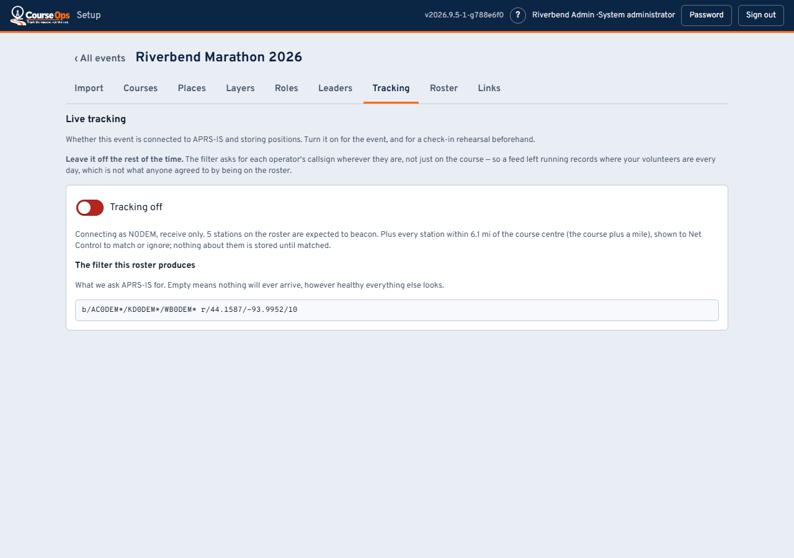
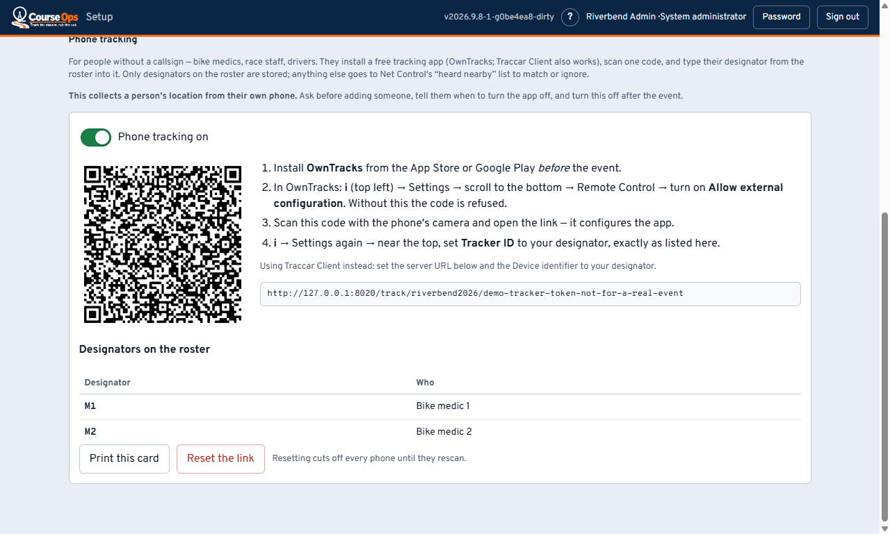

# Setting up an event: race week and after

Turning the feed on, the rehearsal that is worth an hour, and what the organizer
gets when it is over.

> **Setting up, in four parts**
> 1. [The course](setup.md) - events, import, courses, places
> 2. [Roster and links](setup-people.md) - the people, and how they get in
> 3. **Race week and after** - you are here
> 4. [Making it yours](setup-ideas.md) - layers, roles, and what else this can do

---

## Tracking

The APRS-IS feed is **off until somebody turns it on**, and that is a privacy
decision rather than a performance one. The filter asks for each operator's
callsign *wherever they are*, not only on the course - so a feed left running
all year records where your volunteers live and work, which is not what anyone
agreed to by joining a roster.

Turn it on for race day, and for a check-in rehearsal the week before.

The tab shows the exact filter your roster produces. **An empty filter means
nothing will ever arrive**, however healthy everything else on the screen looks -
which is the failure that is hardest to spot on race morning, because a quiet
feed and a quiet net look identical.

For that reason the switch refuses to turn on while there is nothing to listen
for - no station expected to beacon and no course imported - and says so. Add
the people or the course first, then come back. If the feed cannot connect for
some other reason, the switch stays off and the tab reads *Last attempt
stopped:* with the reason.

There is one APRS-IS connection for the whole server, so turning tracking on
for one event turns it off for any other - a rehearsal event left on, say. The
other event's tab says which event took the connection. Deleting an event
stops its feed.

## Phone tracking

For people without a callsign - bike medics, race staff, drivers. They run a
free tracking app on their own phone and it posts their position to the event.
A web page cannot do this: the moment a phone is pocketed the page stops, and
stops silently, leaving a dot that looks live. A tracking app holds real
background-location permission and keeps going.

**This collects a person's location from their own phone.** Ask before adding
someone to the roster, tell them when to turn the app off, and turn the switch
off after the event.

1. On the [Roster tab](setup-people.md#the-roster), add each person with
   **Tracked by: Phone app** and a short designator - `M1`, `M2`, `BIKE1`.
2. On the Tracking tab, switch **Phone tracking** on. The card appears: one
   QR code for the whole event, the three steps, and the exact designators.
3. **Print this card** and put it on the briefing table.

Each person then follows [Being tracked by your phone](phone-tracking.md) -
send them that link with the picture of the card, the week before. In short:

1. Installs **OwnTracks** (free, iOS and Android) *before* the event - a
   scanned code does nothing on a phone without the app.
2. In OwnTracks, turns on **i → Settings → Remote Control (at the bottom)
   → Allow external configuration**. The app refuses configuration links until this is on -
   *URI or file configuration not allowed* is what a skipped step looks
   like.
3. Scans the code with the phone camera and opens the link. That configures
   the app with the event's address.
4. Sets **Tracker ID** in the same settings to their designator, exactly as
   printed.

**Traccar Client** works too: set the server URL from the card and the *Device
identifier* to the designator. Its QR step is not something we can promise, so
they type the URL.

**Why one code for everybody?** The alternative is a code per person: no
typing, but fifteen squares that have to reach the right hands at 6am - and
hand Medic 2 the wrong square and they are Medic 1 on the map, silently. One
code, printed once, and each person types who they are.

**A designator typed differently** (`Medic 1` instead of `M1`) is not lost:
it shows up in Net Control's **Needs attention** list as *a phone app reporting
as MEDIC1*, and Net Control matches it to the right person in one tap. Case,
spaces, dashes and underscores never matter - `m-1` and `M1` are the same.

**Reset the link** cuts off every phone at once until they rescan. It is the
only revocation there is, which is the trade for one code: if a phone with the
app is lost, reset, reprint, and everyone scans again.

Positions arrive late from a phone that lost signal - the app keeps them and
sends them when coverage returns. The map shows each fix at the time it was
taken, never the time it arrived, so a medic coming back into coverage is not
drawn as freshly located somewhere they left ten minutes ago.

## A check-in rehearsal is worth an hour

Turn tracking on a week out and ask everyone who will beacon to do so. What it
finds:

- **Who is on a different SSID than the roster says.** Net Control matches them
  in one tap, and it is far easier to do on a Tuesday than at 06:30.
- **Whose phone app is set up** - the phone-tracked people show a fresh time
  in the stations list once the app is posting, and *never* until it is.
- **Who cannot get into the network at all** from where they will be standing.
- **Whether your filter is right** - see above.

A wrong SSID makes somebody invisible on race day with no error message
anywhere on any screen. This is the hour that prevents it.

## On the day

Start the server, open the map on the Net Control workstation, and check:

- [ ] The connection badge top-right reads **Live**
- [ ] The courses and places are drawn
- [ ] Tracking is **on**
- [ ] At least one mobile station appears within a few minutes

**If the setup screen shows an orange "New version - reload"**, the server has
been updated since you opened that page. Press it when you are between jobs -
it reloads, nothing else. It appears only here, on the setup screen: the
volunteers' pages do not carry it, because there is nothing useful they could
do about it mid-event, and a prompt nobody can act on is the last thing anyone
needs on race morning.

If an update matters to the people in the field, tell them on the net to
reload. That is the same relay everything else in this app uses.

The full event-day procedure - what Net Control does through the morning, and
what to do when something breaks - is in
[`docs/RUNBOOK.md`](../../../docs/RUNBOOK.md) in the repository.

---

## After the event

Every event row has an **After-event report** link. It carries counts, places,
times, course notes and event notes with **no volunteer names**, because it goes to the race
organizer, who needs to know that four runners were collected and where - not
which of your members reported it.

The small maps on it are drawn by the browser from the same tiles as the live
map, so nothing about an incident is sent anywhere the live map does not already
send it.

---

## Two rules worth carrying

**Setup changes reach the field immediately.** Rename a station here and every
phone holding a link updates itself. There is no "publish" step and no reason to
tell anyone to refresh.

**The app is supplemental to the net.** It does not replace the radio, and every
guide you hand out says so on its first screen. Build the event so that a phone
running flat costs somebody convenience, not information.

---

**Next:** [Making it yours](setup-ideas.md) - the parts with no fixed list, and
what clubs can do with them.
