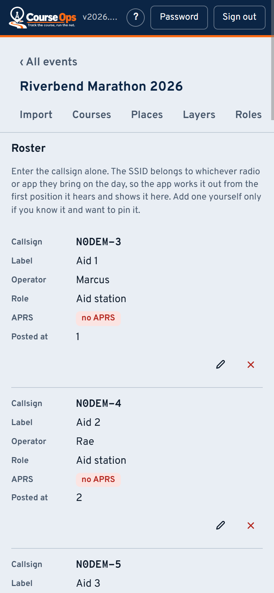
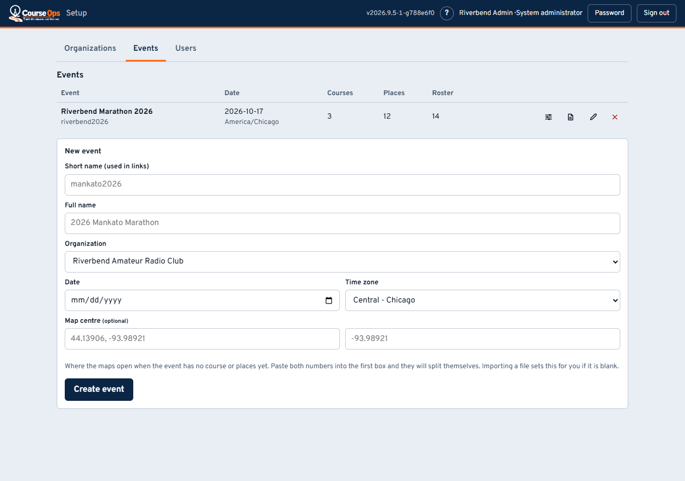
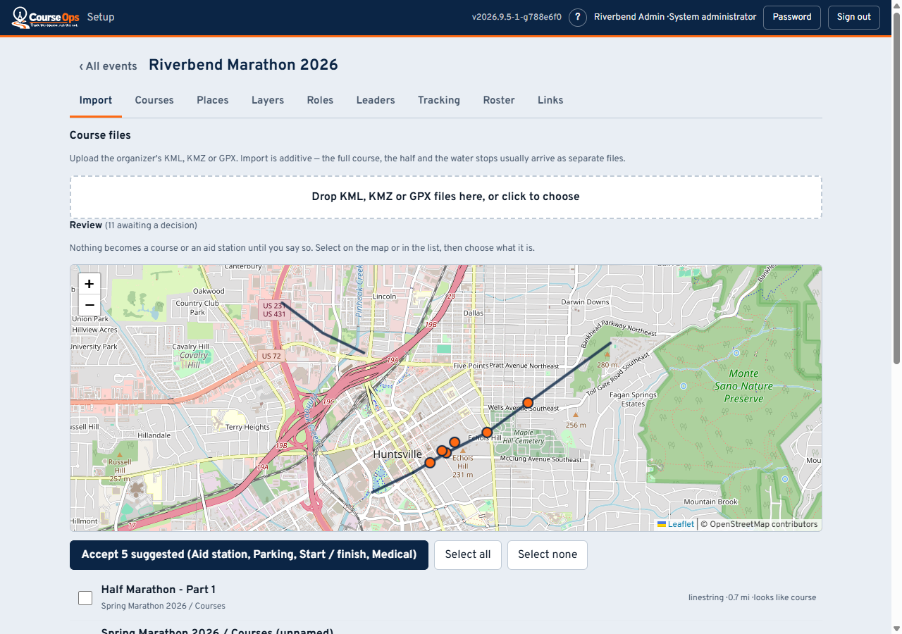
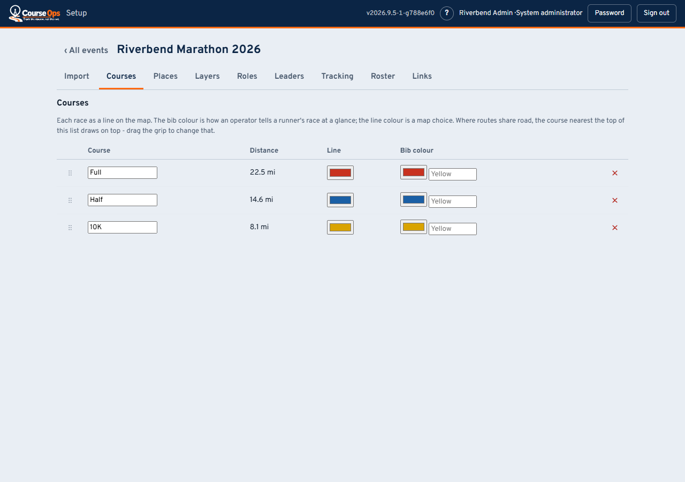
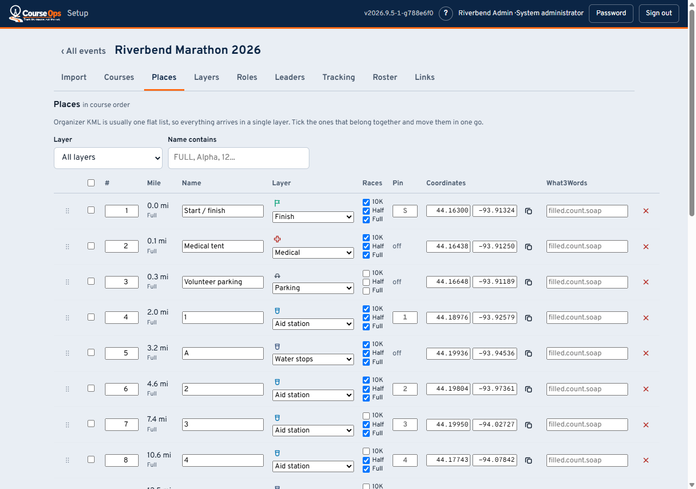
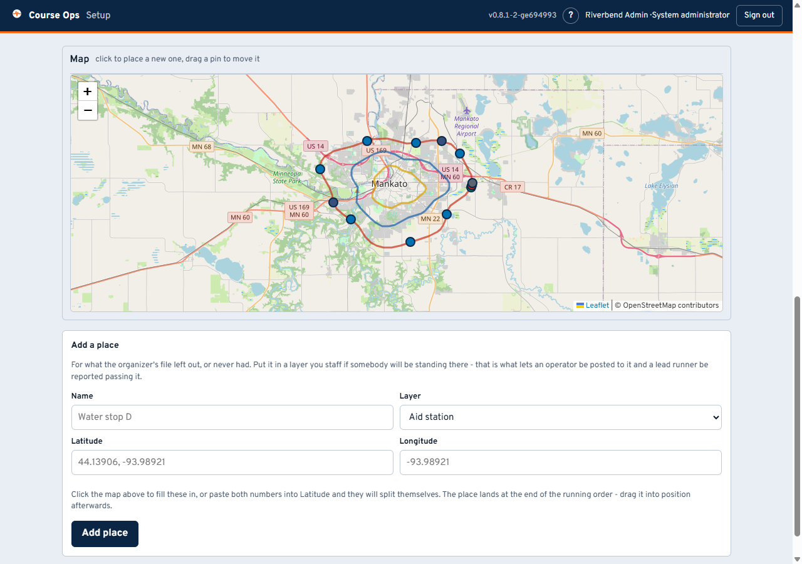

# Setting up an event: the course

For the club officer who stands the event up, not the volunteer holding a link.
The volunteers' pages are [here](README.md).

**Everything here happens in a browser at `/setup`** - opening the bare
address of the server lands there too. Two things stay in a
terminal and nothing else: your club callsign in a file called `.env`, and
starting the server.

It works on a phone as well as at a desk. The tabs become one row you slide
sideways, and every table becomes a stack of cards, one per row, each value
labelled - so a callsign can be fixed from the car park on race morning.

> **Setting up, in four parts**
> 1. **The course** - you are here
> 2. [Roster and links](setup-people.md) - the people, and how they get in
> 3. [Race week and after](setup-race-week.md) - tracking, the rehearsal, the report
> 4. [Making it yours](setup-ideas.md) - layers, roles, and what else this can do

The setup screen has two levels. **Outside an event** there are three tabs -
Organizations, Events and Users - which belong to the installation. **Inside
an event**, opened with the sliders button (**Configure**) on its row of the
Events list, the event's name is the heading, **‹ All events** takes you back out, and the tabs below it -
Import, Courses, Places and the rest - all belong to that one event. They run
roughly in the order you will use them. If your club has a single event it
opens on its own when you sign in.

The address bar follows you (`/setup#events/mankato2026/roster`), so a
bookmark or a reload lands you back inside the same event on the same tab,
and the browser's Back button takes you out of the event.

The **`?`** in the header opens the right one of these four pages for the tab
you are on, in a new tab.

---

## 1. Organizations, then an event

**The very first visit** asks you to create a system administrator account,
and for the **setup code** that the server printed where it was started -
beside the setup address in the console window, or in the server's log. That
code is what makes the person creating the account the person who started
the server, rather than whoever reached the page first. It is new on every
start and asked for exactly once; after that, sign in.

An **organization** is your club. It owns its events and its administrators and
cannot see another club's - so a second club on the same server is properly
walled off, not just tidily separated.

Then **Events**: a short name, a full name, the date, and the time zone. Get the
time zone right, because every clock in the app and in the after-event report is
drawn in it.

**Map centre** is optional. It is where the maps open when the event has no
course or places yet - importing a file fills it in for you, and a course or a
place always wins over it. Type it when there is nothing to import (a parade, a
5K with no file), or the Places map opens on the whole country. Paste both
numbers into the first box and they split themselves.

> **The short name is permanent.** It is in `/e/<short-name>/<link>`, which means
> it is in every link you have handed out. The full name can be changed whenever
> you like; the short name cannot, because changing it would 404 every volunteer
> at once, silently, on the morning they need it.

Creating an event takes you straight into it, on Import.

## 2. Import the course

Drop in the organizer's **KML, KMZ or GPX**. Import is additive - the full
course, the half and the water stops usually arrive as three separate files from
three different tools.

**Nothing becomes a course or a place until you say so.** Everything lands in a
review list, drawn on a map, and you classify it. That is deliberate: organizer
files routinely contain a parking lot named the same as the route, and a
suggestion confident enough to file it as an aid station would be wrong in a way
nobody notices until race day.

The screenshot above is a real export's defects: three placemarks, all named
"Example Marathon", one of them the route and two of them markers. The app says
*looks like course* and *looks like start* and leaves the decision to you.

**Look at the map before you assign anything.** A course split into five
segments, a stray line miles from the route, or a start marker in the wrong car
park is obvious there and invisible in a list of names.

## 3. Courses: colours and draw order

Each race gets a line colour and a **bib colour**, which are two different
things: the line colour is a map choice, the bib colour is how an aid station
operator says *"first yellow male just came through"*.

Where routes share pavement, the course nearest the top of this list draws on
top. Drag the grip to change it. That is the order everyone starts with; any
viewer can re-stack their own screen without affecting anybody else.

Names and colours save together: edit as many rows as you like and one
**Save** button appears above the table, the same as on Places. Dragging saves
the order on its own.

**Check the distance.** If a course reads 3 mi when it should read 13, segments
are missing or one belongs to a different route. **Stitched it wrong? Delete
the course** and its segments go back to the Import tab's review list, ready
to be assigned again - no need to upload the file a second time. Deleting a
place does the same with the point it came from.

Which **leaders** you follow round each of these races - first male, first
female, a wheelchair leader - is on its own tab, and is covered in
[Making it yours](setup-ideas).

## 4. Places

Every point on the map lives here. What each column is for:

- **#** - the club's own running order. Geometry cannot work this out once an
  event has more than one route: each place snaps to whichever line is nearest,
  and where races share road that is a coin flip. Drag or type to set it.
- **Layer** - which kind of place this is. Change one, or tick several and move
  them together, which is what you will do after an import (organizer files
  arrive as one flat list). The layers themselves are yours to invent -
  [see below](setup-ideas.md).
- **Races** - which races this stop serves. State it; do not let it be guessed.
  One water stop routinely serves three races - the organizer's file will
  literally say "WATER (ALL)" - and guessing drops it from every race whose line
  happens to run further away.
- **Pin** - the one or two characters drawn on the pin. Derived from the name,
  and only worth typing when the guess comes out wrong.
- **what3words** - optional, typed in by hand. Aid stations sit at park
  entrances where a street address is useless.

### When the organizer's file is missing places

Some race groups do not hand over a good map, and some hand over one with no
water stops on it at all. A 5K, a parade, or a vehicle race may have people
standing at points with nothing to import in the first place.

**Click the map** where the place goes. That fills in the coordinates below it
and drops a dashed pin so you can see what you picked; name it, choose a layer,
and press *Add place*. Nothing is created until you do, so a stray click costs
nothing.

The routes are drawn underneath, which is the point - a water stop goes
*somewhere along one*, and a blank map gives you nothing to judge that against.

If you would rather type: paste the coordinates into **Latitude** and both
numbers split themselves across the two boxes, so you can copy straight from a
phone or a mapping site without picking the string apart.

Put it in a layer you **staff** if somebody will be standing there. That is what
lets an operator be posted to it and a lead runner be reported passing it; an
unstaffed place is a pin on the map and nothing more. Staffed layers are listed
first for that reason.

The new place lands at the **end** of the running order, where you will see it.
Drag it into position afterwards.

**Places can also be moved.** Drag its pin on the map, or type into the two
boxes in the Coordinates column - either way a place the organizer's file put in
the wrong spot can be moved without re-importing anything.

Dragging a pin does not save on its own. It fills in that row's coordinates and
the table's **Save** button appears, the same as any other edit - so you can
nudge several places and save them together, and nothing is written until you
say so. Everything else follows from position - the mile
figure, which race it snaps to, where the pin draws - so fixing it fixes all of
them at once. Latitude first, then longitude; the app refuses a latitude outside
-90 to 90, which is what catches the two pasted the wrong way round.

**A place with a lead runner sighting at it, or an operator posted to it,
cannot be deleted** until the sightings are cleared and the operator moved, and
the app says how many of each are in the way. Deleting would otherwise take
the sightings with it and quietly un-post the operator - for someone who never
transmits, the only thing putting them on the map. The same applies to a
course with sightings recorded on it.

---

**Next:** [Roster and links](setup-people.md) - who is out there, and how they
get in.
